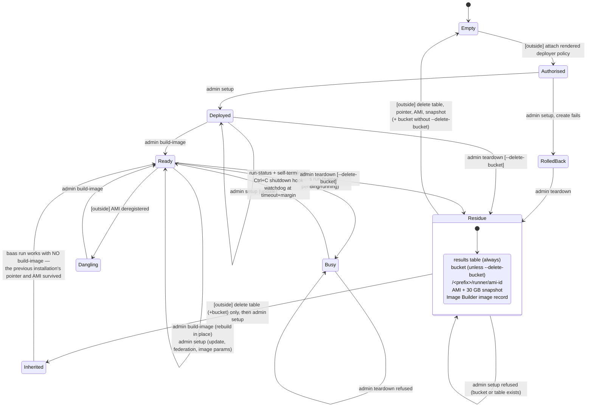
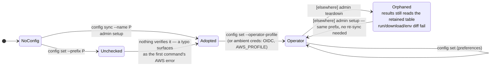
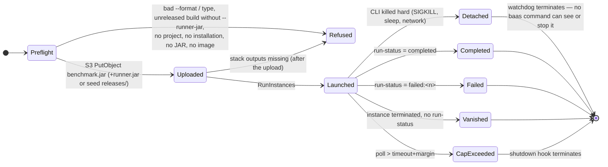

# baas CLI — usage analysis, state graph and gaps

Recorded 2026-10-01 against `main` at `69de3a8` (after `simplify-cli-options`), on branch
`cli-usage-analysis`. Method: a read of every command class and the services they call, offline
probes of the reactor build, and one paid lifecycle test that took the account's installation
from installed → completely empty → installed again (§8).

Diagrams this document leans on, all Mermaid sources in [`docs/diagrams/`](../diagrams/):

| Diagram | What it shows |
|---|---|
| [`c4-1-context.mmd`](../diagrams/c4-1-context.mmd) | People, BaaS, GitHub, AWS |
| [`c4-2-container.mmd`](../diagrams/c4-2-container.mmd) | CLI, config file, stack, bucket, table, AMI pointer, pipeline, runner |
| [`c4-3-component-cli.mmd`](../diagrams/c4-3-component-cli.mmd) | Command groups, services, renderers, `baas-model` |
| [`c4-3-component-runner.mmd`](../diagrams/c4-3-component-runner.mmd) | user-data → `benchmark-runner.jar` internals |
| [`c4-4-deployment.mmd`](../diagrams/c4-4-deployment.mmd) | Laptop, GitHub-hosted runner, IAM, region, subnet |
| [`baas-lifecycle.mmd`](../diagrams/baas-lifecycle.mmd) | One installation from empty account to empty account |
| [`baas-setup.mmd`](../diagrams/baas-setup.mmd), [`baas-build-image.mmd`](../diagrams/baas-build-image.mmd), [`baas-teardown.mmd`](../diagrams/baas-teardown.mmd) | Admin commands |
| [`baas-config-sync.mmd`](../diagrams/baas-config-sync.mmd) | Adopting an installation (human and CI) |
| [`baas-run.mmd`](../diagrams/baas-run.mmd) | One run |
| [`baas-results.mmd`](../diagrams/baas-results.mmd), [`baas-download-env-diff.mmd`](../diagrams/baas-download-env-diff.mmd) | Read commands |
| [`baas-ci-e2e.mmd`](../diagrams/baas-ci-e2e.mmd) | `e2e-cloud-test.yml` |

## 1. Command surface

Every command also takes `-h`, `-V`, `-v` and the inherited `--config-path <file>`.

| Command | Options | Credentials | Writes config |
|---|---|---|---|
| `admin deployer-policy` | `--for-account`, `--prefix` | deployer (`aws.profile`); none with `--for-account` | no |
| `admin setup` | `--region`, `--aws-profile`, `--use-existing-vpc` `--vpc-id` `--subnet-id` `--sg-id`, `--github-org` `--github-repo`… `--oidc-provider-arn`, `--revoke-github-oidc` | deployer | prefix, profile, region |
| `admin build-image` | `--aws-profile` | deployer | no |
| `admin image` | `--aws-profile` | deployer | no |
| `admin teardown` | `--stack-name`, `--yes`, `--delete-bucket` | deployer | no |
| `config set` | `--aws-profile`, `--operator-profile`, `--region`, `--instance-type`, `--timeout`, `--watchdog-margin`, `--git-resolve-project`, `--prefix` | none | yes |
| `config show` | — | none | no |
| `config sync` | `--name` (required) | operator | prefix |
| `run <type> -- <params>` | `--benchmark-jar` (required), `--runner-jar`, `--project`, `--tag k=v`…, `--instance-type`, `--timeout`, `--watchdog-margin`, `--no-database`, `--format text\|json` | operator | no |
| `results` | `--project` \| `--all-projects` \| `--request-id`, `--benchmark-name`, `--tag`…, `--group-by`, `--all-runs`, `--limit`, `--format table\|json\|csv`, `--watch` | operator | no |
| `download <runId\|path>` | `-o` | operator | no |
| `env diff <pathA> <pathB>` | — | operator | no |

### Where each setting can come from

The precedence is always flag over config file over built-in default. What differs is which commands offer the flag at all:

| Setting | Flag on | `config set` | Environment | Default |
|---|---|---|---|---|
| region | `admin setup` only | yes | **not read** (`AWS_REGION` ignored) | `eu-central-1` |
| deployer profile | `setup`, `build-image`, `image` | yes | `AWS_PROFILE` only when `aws.profile` is unset | none → default chain |
| operator profile | — | yes | `AWS_PROFILE` / OIDC when unset | none → default chain |
| prefix | — | `--prefix` (unchecked) | — | none; `setup` / `config sync` write it |
| instance type, timeout, watchdog margin | `run` | yes | — | `c5.2xlarge`, 7200 s, 300 s |
| git project derivation | — | yes | — | off |
| `runner.sourceRepo` | — | **no** (hand-edit only) | — | `wsztajerowski/benchmark-as-a-service` |

### Human vs CI reach

CI holds `OperatorRole` through OIDC and nothing else. By design it can run `config sync`/`set`/`show`, `run`, `results`, `download` and `env diff`, and none of `admin`.

Every option a CI operator command needs is reachable from CI, with one exception: **region**. The
workflow sets `vars.AWS_REGION` for `configure-aws-credentials`, but `baas` reads region only from its
config file. A fresh CI config therefore defaults to `eu-central-1` no matter what the variable says.
That works today only because the installation happens to be in that region (U5).

A human needs, in order:
1. A deployer identity with the rendered policy attached, which happens outside the CLI.
2. `admin setup` and `admin build-image`.
3. An operator profile in `~/.aws/config` with an `sts:AssumeRole` grant, also outside the CLI.
4. `config set --operator-profile`.

The CLI prints each step as it goes. Only the IAM steps are missing from the root `--help` footer, which points at `infra/README.md` for them.

## 2. State graph

Three independent machines interact: the account's installation, one operator machine's
configuration, and one run. Transitions are CLI commands unless written `[outside]`, meaning the AWS
console or CLI, IAM, or the passage of time.

### 2.1 Installation (one per account)

Orthogonal flag on `Deployed`/`Ready`: **federated** ↔ **not federated**. Turned on by `setup
--github-org --github-repo --oidc-provider-arn` and off by `setup --revoke-github-oidc`. A plain
`setup` carries it forward.

### 2.2 Operator machine

The prefix is derived from the account, so a machine never needs re-syncing across a teardown and
setup. §8 confirmed this: the pre-existing `~/.baas/config.yaml` ran a benchmark against the
reinstalled stack untouched.

### 2.3 One run

## 3. Gaps — states and outcomes the CLI cannot reach

| ID | Gap | Sev | Evidence |
|---|---|---|---|
| U1 | **Teardown does not remove the image.** `/<prefix>/runner/ami-id`, the AMI, its 30 GB snapshot and the Image Builder image record all survive, so "remove BaaS from this account" is not reachable with `baas`. Once the table is cleared by hand, a later `setup` lands in *Inherited*: `run` works with no `build-image`, on an AMI whose component the stack deleted. The standing snapshot cost also never stops. | Med | §8: all four survived. An AMI from the August caller-ARN installation (`3q7i7s65-runner-…`) had survived seven weeks the same way |
| U2 | **No CLI path from *Residue* to *Empty*.** The table has no delete flag by design. The four image leftovers (U1) and a table retained by a rolled-back create both need `aws` by hand. The deployer can't even *list* what is left: it lacks `cloudformation:ListStacks`, `s3:ListAllMyBuckets`, `ssm:DescribeParameters` and `dynamodb:ListTables`, and it can't delete the old installation's Image Builder component. | Low | §8 |
| U3 | **A detached run is invisible.** If the CLI dies without its shutdown hook (SIGKILL, laptop sleep, lost network), no `baas` command lists in-flight runs, reattaches to one, or terminates one. Teardown refuses while one exists, and its advice is "terminate them manually". The watchdog bounds the cost to `timeout + margin` (2 h 05 m by default). | Med | `TeardownCommand`, `RunCommand.poll` |
| U4 | **`env diff` accepts result paths only.** `results` shows run ids, and `download` accepts either form. A human going from `results` to `env diff` has to hand-compose `runs/<project>/<runId>`, which CLAUDE.md calls the error-prone thing (`RunLayout` is the only builder). Passing a run id fails with a misleading reason: "No environment.json at s3://…/<runId>/environment.json — Runs from before the prebaked-image change carry no environment manifest". | Low | `EnvDiffSubcommand`; §8 |
| U5 | **Region cannot come from the environment.** `AWS_REGION` is ignored, and `config sync` has no `--region`. CI is right only because `vars.AWS_REGION` happens to equal the default. Another region needs `config set --region` first, which the workflow does not do. | Med | `AwsClientFactory`, `BaasConfig.AwsConfig`, `e2e-cloud-test.yml` |
| U6 | **The deployer profile is overridable on three of five admin commands.** `teardown` and `deployer-policy` have no `--aws-profile`. `setup` persists the override while `build-image`/`image` don't. | Low | admin commands |
| U7 | **`config set --prefix` adopts an installation unchecked** and duplicates `config sync --name` minus its existence check, the check CLAUDE.md says is the reason sync requires the name. | Low | `ConfigSetSubcommand` |
| U8 | **`runner.sourceRepo` can only be set by hand-editing YAML**, though the error message says that is how to set it. | Info | `RunnerJarResolver.assetUrl` |
| U9 | **`run` uploads before it checks the stack.** `resolveNetworking` runs after the JAR upload, so a torn-down or wrong installation uploads the benchmark JAR, then fails on missing outputs. | Low | `RunCommand.execute` |
| U10 | **`admin image` needs deployer credentials** for a read that `OperatorRole` can already do (`ssm:GetParameter`, `ec2:DescribeImages`; `run` makes the same call). An operator can't ask which image their next run will use. | Low | `ImageCommand` |
| U11 | **The runner shares its security group with the image-build instance.** The 80/443 internet egress exists for `dnf`/GitHub during the bake. "The instance contacts no host outside the account" is therefore enforced by the user-data script, not the network, and the rule descriptions still say "HTTPS to GitHub" and "package downloads (yum)". | Med | `RunnerImageInfrastructure.SecurityGroupIds`, `RunnerSecurityGroup` |
| U12 | **A failed first create traps the next setup.** `ROLLBACK_COMPLETE` → teardown → setup is refused while the create's retained table exists, and only `aws dynamodb delete-table` clears it. Not exercised; it would need a forced create failure. | Low | static |
| U13 | **A successful run logs "Terminating instance …"** and calls `TerminateInstances` on an already-terminated instance, because the shutdown hook is never deregistered. | Info | `RunCommand.execute` |
| U14 | **Reinstall breaks the AWS CLI's cached role credentials.** After teardown + setup, the AWS CLI (not `baas`) fails with `InvalidClientTokenId` on the operator profile until its cached session expires: the role was recreated with a new id. `baas` is unaffected because the SDK does not read `~/.aws/cli/cache`. | Info | §8 |
| U15 | **The results table formats scores in the JVM's locale** (`9702970,774` under pl-PL). That's right for a human reading it, and JSON/CSV are unaffected (`Locale.ROOT`). Recorded so nobody "fixes" it into a parsing bug: the table is not a machine format. | Info | §8 |

## 4. Fixed on this branch

| ID | Defect | Fix |
|---|---|---|
| F1 | `config show` printed its whole dump through the logger (stderr, timestamped), so `baas config show > f` produced an empty file, against the payload rule in CLAUDE.md | Printed through `Console` |
| F2 | `--format` was not validated: `results --format xml` printed the table, and `run --format jsno` printed no summary, both reporting success | Unknown values exit 2 |
| F3 | Teardown's live-runner gate looked at `running` only, so a run launched seconds before could have its role and subnet deleted under it | `pending` counts as live. Observed: the gate caught a run 6 s after launch |
| F4 | The friendly `ROLLBACK_COMPLETE` refusal lived only in `createOrUpdateStack`, which setup calls only when the stack does *not* exist, so it was dead code and setup surfaced CloudFormation's raw error | Moved onto the update path setup uses (`CloudFormationService.requireUpdatable`) |
| F5 | `describeImage` mapped *every* EC2 error to "no image", so a denied `DescribeImages` told the operator to rebuild an image that existed | Only `InvalidAMIID.*` means absent; the new test fails without the fix |
| F6 | Stale text: misplaced javadocs in `RunCommand` and `SetupCommand` (including the old caller-ARN hash), "name is fixed by your caller ARN" in setup's own error message, `benchmarkMetadata.tags`, `--ami-id`, a teardown diagram describing an SSM delete and `aws.coreStackName` that no longer exist, and a README E2E section for the deleted `act` harness | Corrected |

## 5. Simplifications

In rough order of value:

1. **Teardown owns the image** (closes U1, most of U2). Retire the pointed-to AMI with the
   existing `ImageBuilderService.retire`, then delete the parameter. Two calls, both already in the
   deployer policy's vocabulary, and it removes four manual commands plus the *Inherited* state.
2. **One resolver for "run id or path"** shared by `download` and `env diff` (closes U4). The run-id
   branch already exists in `DownloadCommand`.
3. **Read region like the AWS CLI does**: config file, then `AWS_REGION`, then the default (closes U5).
   This removes the need for a `--region` on `sync` and keeps CI correct in any region.
4. **One inherited `--aws-profile` on `admin`**, replacing the three per-command copies (closes U6).
5. **Drop `config set --prefix`** (closes U7). `config sync --name` covers it, and so does `--config-path` for by-hand files.
6. **`baas image` under operator credentials**, or fold the image line into `config show` (closes U10).
7. **`createOrUpdateStack` → `createStack`.** Setup sends every existing stack through
   `updateStackParameters`, so the update branch is unreachable.
8. **Resolve networking before uploading** (closes U9). It's one `DescribeStacks` call moved up.
9. **A separate build security group** (closes U11). The runner then gets 443 to AWS endpoints only,
   which turns the network into what enforces the no-egress invariant. Rule descriptions are
   mutable without replacement, and `GroupDescription` must not be touched.

Not proposed: a `--detach`/`attach` pair for U3. It would need run discovery by tag, and the
watchdog already bounds the cost. A read-only `baas runs` that lists `baas-role=benchmark-runner`
instances, plus `--terminate <id>`, is the smaller answer if U3 is ever worth closing.

## 6. What holds up

- **Every failure the CLI can detect before spending money, it detects before spending money.** The
  order is unreleased build, project, table, JAR, image, upload, launch, and §8 hit the image check
  for real.
- **Re-installation is transparent to operator machines**, because the prefix is account-derived (§2.2, §8).
- **Federation survives updates and is restored on create** when the flags are passed. §8 recreated
  the operator role's GitHub trust in a single `setup` call.
- **No CI-only option exists:** every flag CI passes is one a human can pass, and vice versa for operator commands.

## 7. Open questions for the walkthrough

These are deliberately not decided here:
- ~~U1: should teardown retire the image unconditionally, or behind a flag like `--delete-bucket`?~~
  **Decided 2026-10-01: unconditionally.** The image is cheap to rebuild and git is its archive, while
  a surviving pointer is what lets a later setup run on an inherited image unnoticed. To be
  implemented as its own OpenSpec change.
- ~~U3: is a run listing worth a command, given the watchdog bound?~~
  **Decided 2026-10-02: yes, and run status moves from S3 into DynamoDB**, so the bucket goes back to
  being write-once storage that nothing polls. Shape agreed:
  - One table, not a separate `-runs` table, which would need a new retained resource and an edit to
    the deployer policy, already near its size budget. Run items live in a `RUN#<project>` partition
    with `sk = <createdAt>#<runId>` and `gsi1pk = <runId>`, so `requestId-index` resolves failed runs
    and `download <runId>` needs no S3 fallback.
  - Writers: the CLI writes `launched` and, from its shutdown hook, `cancelled`; the instance's shell
    writes `running` and then `completed` / `failed:<n>` in place of the `run-status` object. Every
    write is a conditional `UpdateItem` that never overwrites a terminal status. "Vanished" stays
    inferred at read time (non-terminal status, instance gone).
  - IAM: OperatorRole gains `dynamodb:UpdateItem` restricted by `dynamodb:LeadingKeys` to `RUN#*`,
    its first write right on the table, granted deliberately. RunnerRole gains the same, and its
    existing `PutItem`/`BatchWriteItem` are narrowed to `RESULT#*` in the same edit (tightens S7).
    The deployer policy is unchanged.
  - Every Scan and every `requestId-index` reader must exclude run items, with tests. The project
    picker derives names from `pk`, so a miss there fails silently.
  - `baas runs`: one reverse `Query` per project plus `DescribeInstances`; `--terminate <runId>`.
  - Costs (estimated): about $0.00015 of reads to poll a 2-hour run, against about $0.0002 of S3 GETs
    today; listing 10,000 runs takes ~0.2 s instead of ~70 s. Effort is two to three times the
    S3-listing alternative, including an IAM change.
  To be implemented as its own OpenSpec change. Doing it now means no backfill: the table holds
  two runs.
- U11: is a second security group worth a stack replacement of nothing (new resource only)?

## 8. Paid lifecycle test (2026-10-01)

Pinned CLI: reactor build of `69de3a8` (before the fixes above). Account `381492019823`, `eu-central-1`.
Backups of the config, all 19 table items and all 202 S3 objects (657 MB) were taken first, outside the repository.

| # | Step | Result |
|---|---|---|
| 1 | `admin teardown --yes --delete-bucket` | Exit 0 in 36 s. Bucket emptied and deleted, stack deleted, retained-table notice printed. **No mention of the image.** |
| 2 | Residue check | Survived: `/baas-381492019823/runner/ami-id`, `ami-05bbf52f…` + `snap-07597ebe…` (30 GB), the results table, the Image Builder image record. Also still present from the August caller-ARN installation: `ami-0aa25ec7…` (`3q7i7s65-runner-…`) + snapshot, its component, and image records 1.0.0–1.2.0. → U1, U2 |
| 3 | Wipe by hand (`aws`, deployer identity) | Table, parameter, both AMIs and both snapshots deleted. The `3q7i7s65` component was refused (outside the deployer's prefix scope) and left in place; components cost nothing. Listing what else might be left was denied (`ListStacks`, `ListAllMyBuckets`, `DescribeParameters`, `ListTables`). |
| 4 | `admin setup` from a fresh `--config-path`, with the three federation flags | Exit 0 in 98 s. The operator role's trust carries both the account root and the GitHub OIDC principal. |
| 5 | `run` before any image | Refused before any upload ("No runner image is published"). Bucket stayed empty. |
| 6 | `admin build-image` (**paid 1**) | Exit 0 in 8 min 10 s, `ami-072e0a34…`. The build was numbered `1.2.0/2`: the image record of step 2 counts. |
| 7 | `run jmh` from the **old** `~/.baas/config.yaml` (**paid 2**) | Completed in 95 s with no re-sync. Then logged "Terminating instance …" for an instance that had already terminated → U13. Table score shown as `9702970,774` → U15. |
| 8 | Patched CLI: teardown with no `--yes`, `stdin` closed, during step 7 | Refused, naming `i-06ebd67a…`, 6 s after launch (almost certainly still `pending`; F3). Nothing deleted. |
| 9 | Read side | `results --request-id` JSON carried every machine-observed tag. The project sweep correctly found nothing visible. `download` fetched 8 artifacts. `env diff` by path gave "No differences". By run id it failed misleadingly → U4. `config show > f` wrote 20 lines (F1). `results --format xml` exited 2 (F2). |
| 10 | `e2e-cloud-test.yml`, `workflow_dispatch` on `main` (**paid 3**) | Green: OIDC into the recreated role, `config sync`, `jmh-with-async` with flamegraph and JFR, 11 artifacts, every assertion. |
| — | AWS CLI with the operator profile after step 4 | `InvalidClientTokenId` from the cached session of the deleted role; `baas` itself unaffected → U14. |

End state: one installation, `baas-381492019823`, federated, image 1.2.0 published, no live
instances. The backed-up S3 objects and table items were **not** restored. They were test runs, as
agreed, and the backup stays in the session scratchpad until the session ends.
