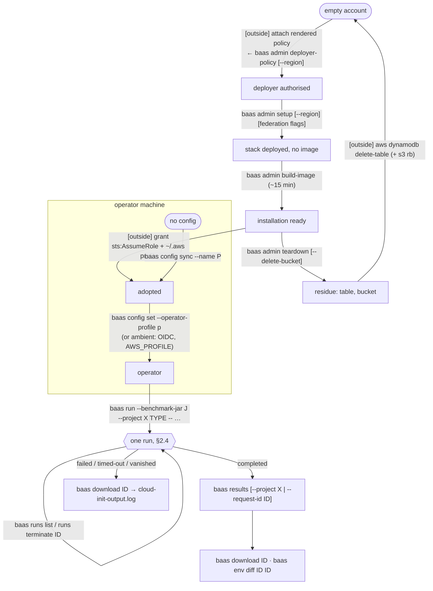
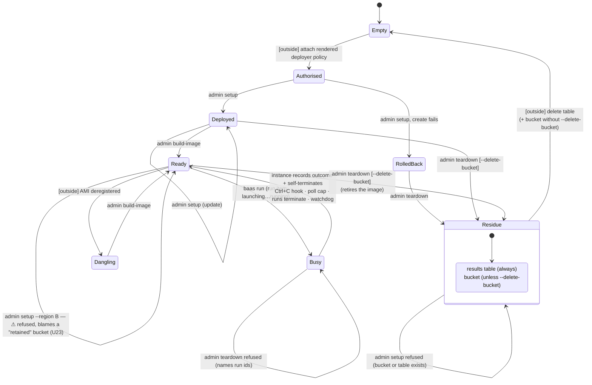
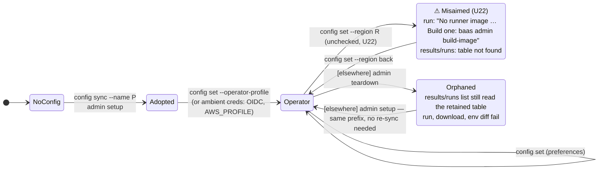
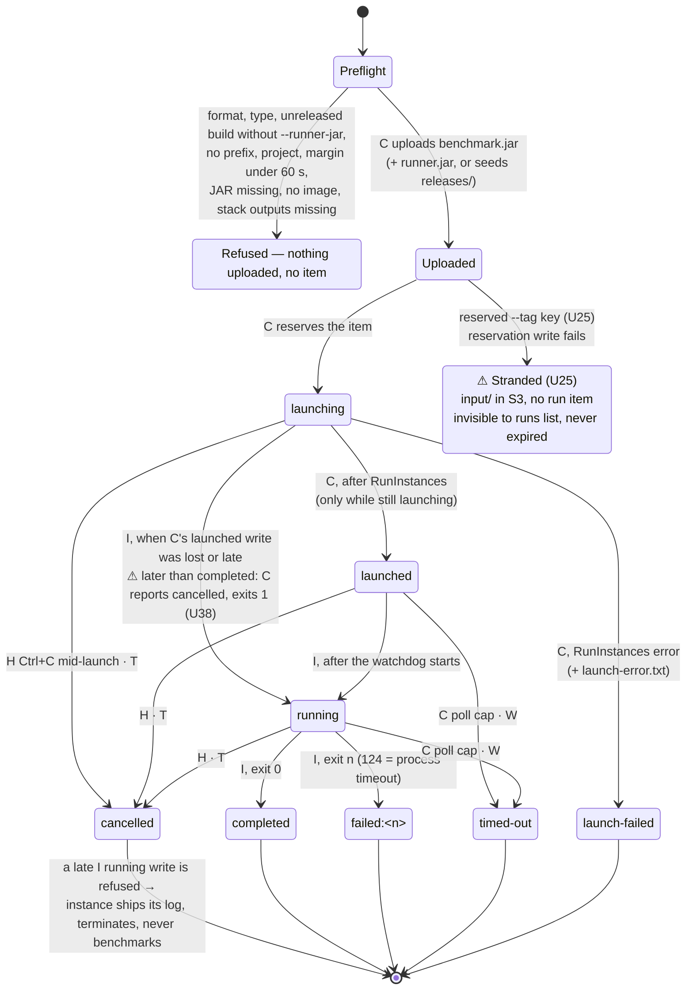

# baas CLI — usage analysis, state graph and gaps

Recorded 2026-10-01 against `main` at `69de3a8` (after `simplify-cli-options`), on branch
`cli-usage-analysis`. Method: a read of every command class and the services they call, offline
probes of the reactor build, and one paid lifecycle test that took the account's installation
from installed → completely empty → installed again (§8).

**Refreshed 2026-10-04** against `4e90834` (branch `custom-runner-image`, committed state: run items,
`baas runs`, teardown retiring the image). Static read only — no AWS call, no paid run. §1 and §2
are rewritten for the current command surface; §3 keeps every earlier row and adds U21–U37; §3.1 is
new and answers "which required value can a user not obtain". The uncommitted `custom-runner-image`
apply in the same working tree is not analysed as current behaviour; where it changes a finding, the
row says so.

**Re-checked 2026-10-04** against `origin/next-release` at `9a84a18` (branch `cli-usage-reanalysis`),
which by then carried `custom-runner-image` (`b6193ec`) and the whole-repository review fixes. Every
row's code anchor was re-read there. U21 and U37 are fixed in code; every other open row still holds
unchanged. New: U38 (filed by that change's verify, review §55) is placed in §2.4, and the
`--extension` surface adds U39–U41. §2.2, §2.4 and §3.1 are updated to match.

Diagrams this document leans on, all Mermaid sources in [`docs/diagrams/`](../diagrams/):

| Diagram | What it shows |
|---|---|
| [`c4-1-context.mmd`](../diagrams/c4-1-context.mmd) | People, BaaS, GitHub, AWS |
| [`c4-2-container.mmd`](../diagrams/c4-2-container.mmd) | CLI, config file, stack, bucket, table, AMI pointer, pipeline, runner |
| [`c4-3-component-cli.mmd`](../diagrams/c4-3-component-cli.mmd) | Command groups, services, renderers, `baas-model` |
| [`c4-3-component-runner.mmd`](../diagrams/c4-3-component-runner.mmd) | user-data → `benchmark-runner.jar` internals |
| [`c4-4-deployment.mmd`](../diagrams/c4-4-deployment.mmd) | Laptop, GitHub-hosted runner, IAM, region, subnet |
| [`baas-lifecycle.mmd`](../diagrams/baas-lifecycle.mmd) | One installation from empty account to empty account |
| [`baas-setup.mmd`](../diagrams/baas-setup.mmd), [`baas-build-image.mmd`](../diagrams/baas-build-image.mmd), [`baas-teardown.mmd`](../diagrams/baas-teardown.mmd) | Admin commands |
| [`baas-config-sync.mmd`](../diagrams/baas-config-sync.mmd) | Adopting an installation (human and CI) |
| [`baas-run.mmd`](../diagrams/baas-run.mmd) | One run |
| [`baas-results.mmd`](../diagrams/baas-results.mmd), [`baas-download-env-diff.mmd`](../diagrams/baas-download-env-diff.mmd) | Read commands |
| [`baas-ci-e2e.mmd`](../diagrams/baas-ci-e2e.mmd) | `e2e-cloud-test.yml` |

## 1. Command surface

Every command also takes `-h`, `-V`, `-v` and the inherited `--config-path <file>`.

| Command | Options | Credentials | Writes config |
|---|---|---|---|
| `admin deployer-policy` | `--for-account`, `--prefix`, `--region` | deployer (`aws.profile`); none with `--for-account` | no |
| `admin setup` | `--region`, `--aws-profile`, `--use-existing-vpc` `--vpc-id` `--subnet-id` `--sg-id`, `--github-org` `--github-repo`… `--oidc-provider-arn`, `--revoke-github-oidc` | deployer | prefix, profile, region |
| `admin build-image` | `--extension <file>` (replaces the installation's extension; comments only removes it) | deployer | no |
| `admin image` | `--extension` (prints the deployed extension, or the starter, with its marker) | deployer | no |
| `admin teardown` | `--stack-name`, `--yes`, `--delete-bucket` | deployer | no |
| `config set` | `--aws-profile`, `--operator-profile`, `--region`, `--instance-type`, `--timeout`, `--watchdog-margin`, `--git-resolve-project` | none | yes |
| `config show` | — | none | no |
| `config sync` | `--name` (required) | operator | prefix |
| `run <type> -- <params>` | `--benchmark-jar` (required), `--runner-jar`, `--project`, `--tag k=v`…, `--instance-type`, `--timeout`, `--watchdog-margin`, `--format text\|json` | operator | no |
| `runs list` | `--limit` (≥1, default 20), `--in-flight`, `--project`, `--tag`…, `--format table\|json\|csv` | operator | no |
| `runs terminate <runId>` | `--yes` (required without a terminal) | operator | no |
| `results` | `--project` \| `--all-projects` \| `--request-id`, `--benchmark-name`, `--tag`…, `--group-by`, `--all-runs`, `--limit`, `--format table\|json\|csv`, `--watch` | operator | no |
| `download <runId\|path>` | `-o` | operator | no |
| `env diff <pathA> <pathB>` | — | operator | no |

### Where each setting can come from

The precedence is always flag over config file over built-in default. What differs is which commands offer the flag at all:

| Setting | Flag on | `config set` | Environment | Default |
|---|---|---|---|---|
| region | `admin setup` (saved), `admin deployer-policy` (render only) | yes | `AWS_REGION`, only when the file names none (F9) | `eu-central-1` |
| deployer profile | `setup` only (saved) | yes | `AWS_PROFILE` only when `aws.profile` is unset | none → default chain |
| operator profile | — | yes | `AWS_PROFILE` / OIDC when unset | none → default chain |
| prefix | — | — (F14) | — | none; `setup` / `config sync --name` write it |
| instance type, timeout, watchdog margin | `run` | yes | — | `c5.2xlarge`, 7200 s, 300 s |
| git project derivation | — | yes | — | off |
| `runner.sourceRepo` | — | **no** (hand-edit only) | — | `wsztajerowski/benchmark-as-a-service` |

### Human vs CI reach

CI holds `OperatorRole` through OIDC and nothing else. By design it can run `config sync`/`set`/`show`, `run`, `runs`, `results`, `download` and `env diff`, and none of `admin`.

Every option a CI operator command needs is reachable from CI. Region was the exception until F9:
a fresh CI config now follows `AWS_REGION`. What CI still cannot do in one call is ask what happened
to *its own* run: the `--format json` summary says only `completed`/`failed` (U27), and there is no
lookup by run id (U28), so `e2e-cloud-test.yml` lists 50 runs and filters them with `jq`.

A human needs, in order:
1. A deployer identity with the rendered policy attached, which happens outside the CLI.
2. `admin setup` and `admin build-image`.
3. An operator profile in `~/.aws/config` with an `sts:AssumeRole` grant, also outside the CLI.
4. `config set --operator-profile`.

The CLI prints each step as it goes. Only the IAM steps are missing from the root `--help` footer, which points at `infra/README.md` for them.

## 2. State machines

Three independent machines interact: the account's installation (§2.2), one operator machine's
configuration (§2.3), and one run (§2.4). §2.1 strings them together as the workflow a user actually
walks. Transitions are CLI commands unless written `[outside]`, meaning the AWS console or CLI, IAM, or
the passage of time. A state marked ⚠ is one the CLI lets you into but gives no correct way out of, or
explains wrongly; its gap ID is beside it.

### 2.1 The workflow, end to end

The order the root `--help` footer prints is this graph's spine. Two steps happen outside the CLI and
always will: attaching the deployer policy and granting `sts:AssumeRole` on `OperatorRole`.

### 2.2 Installation (one per account)

Any region now reaches *Ready*: setup and build-image resolve the pinned AL2023 release's AMI in the
installation's region (U21, fixed; live check deferred). The image is the bundled base plus the
installation's extension, which lives only in the stack parameter `RunnerImageExtensionData`.

Orthogonal flag on `Deployed`/`Ready`: **federated** ↔ **not federated**, set by `setup --github-org
--github-repo --oidc-provider-arn`, cleared by `setup --revoke-github-oidc`, carried forward by a plain
`setup`. Networking is a second orthogonal attribute, fixed at create; an update naming different
networking is refused before anything is submitted.

### 2.3 Operator machine

The prefix is account-derived, so a machine never needs re-syncing across teardown and setup (§8).
The region is the one adoption-shaped setting `config set` still writes without checking it (U22).

### 2.4 One run

The run item's `status` attribute is the machine. Every write after the reservation is a conditional
`UpdateItem` that never replaces a terminal status, so the first outcome to land wins. Writers:
**C** = the CLI running `baas run`, **H** = its shutdown hook, **T** = `baas runs terminate` (any
operator), **I** = the instance's user-data, **W** = the instance's watchdog.

Never stored, computed by readers:

| Shown as | When | Who computes it |
|---|---|---|
| `vanished` | Non-terminal status and no pending/running instance tagged with the run id | `runs list` (one `DescribeInstances`), `baas run`'s poll |
| `status-lost` | As `vanished`, but measurements exist under the run id | `baas run`'s poll only |
| `completed`/`failed` | The only two values `baas run --format json` reports, whatever the item says (U27) | `RunCommand.printRunSummary` |

U38 and U30 are one rule missing in two places: a refusal or a terminal status that only the instance
can write (`completed`, `failed:<n>`) means the instance got there first and terminates itself.
`RunSession.stop` applies it; `RunSession.confirmLaunched` and `RunTermination` do not.

A launching run whose instance is not yet visible to `DescribeInstances` lists as `vanished` for a few
seconds (U31). An instance that recorded `completed`/`failed:<n>` keeps running while it uploads its
boot log; the hook and the poll cap leave it alone, `runs terminate` does not (U30).

## 3. Gaps — states and outcomes the CLI cannot reach

| ID | Gap | Sev | Evidence |
|---|---|---|---|
| U1 | **Teardown does not remove the image.** `/<prefix>/runner/ami-id`, the AMI, its 30 GB snapshot and the Image Builder image record all survive, so "remove BaaS from this account" is not reachable with `baas`. Once the table is cleared by hand, a later `setup` lands in *Inherited*: `run` works with no `build-image`, on an AMI whose component the stack deleted. The standing snapshot cost also never stops. | Med · **Fixed** | F15 |
| U2 | **No CLI path from *Residue* to *Empty*.** The table has no delete flag by design. The four image leftovers (U1) and a table retained by a rolled-back create both need `aws` by hand. The deployer can't even *list* what is left: it lacks `cloudformation:ListStacks`, `s3:ListAllMyBuckets`, `ssm:DescribeParameters` and `dynamodb:ListTables`, and it can't delete the old installation's Image Builder component. | Low · Partly fixed | F15 (image); table and bucket → `export-before-teardown` |
| U3 | ~~**A detached run is invisible.**~~ **Fixed by `run-status-in-dynamodb`:** run status lives on a run item, `baas runs list` shows every run and `baas runs terminate` stops one. If the CLI dies without its shutdown hook (SIGKILL, laptop sleep, lost network), no `baas` command lists in-flight runs, reattaches to one, or terminates one. Teardown refuses while one exists, and its advice is "terminate them manually". The watchdog bounds the cost to `timeout + margin` (2 h 05 m by default). | Med · **Fixed** | `run-status-in-dynamodb` |
| U4 | **`env diff` accepts result paths only.** `results` shows run ids, and `download` accepts either form. A human going from `results` to `env diff` has to hand-compose `runs/<project>/<runId>`, which CLAUDE.md calls the error-prone thing (`RunLayout` is the only builder). Passing a run id fails with a misleading reason: "No environment.json at s3://…/<runId>/environment.json — Runs from before the prebaked-image change carry no environment manifest". | Low · **Fixed** | F11 |
| U5 | **Region could not come from the environment.** `AWS_REGION` was ignored and `config sync` had no `--region`, so CI was right only because `vars.AWS_REGION` equalled the default. | Med · **Fixed** | F9 |
| U6 | **The deployer profile is overridable on three of five admin commands.** `teardown` and `deployer-policy` have no `--aws-profile`. `setup` persists the override while `build-image`/`image` don't. | Low · **Fixed** | F12 |
| U7 | **`config set --prefix` adopts an installation unchecked** and duplicates `config sync --name` minus its existence check, the check CLAUDE.md says is the reason sync requires the name. | Low · **Fixed** | F14 |
| U8 | **`runner.sourceRepo` can only be set by hand-editing YAML**, though the error message says that is how to set it. | Info | `RunnerJarResolver.assetUrl` |
| U9 | **`run` uploads before it checks the stack.** `resolveNetworking` runs after the JAR upload, so a torn-down or wrong installation uploads the benchmark JAR, then fails on missing outputs. | Low · **Fixed** | F10 |
| U10 | **`admin image` needs deployer credentials** for a read that `OperatorRole` can already do (`ssm:GetParameter`, `ec2:DescribeImages`; `run` makes the same call). An operator can't ask which image their next run will use. | Low · Won't fix | Decided 2026-10-02: `admin image` stays as is — what an operator needs is in each run's `environment.json` |
| U11 | **The runner shares its security group with the image-build instance.** The 80/443 internet egress exists for `dnf`/GitHub during the bake. "The instance contacts no host outside the account" is therefore enforced by the user-data script, not the network, and the rule descriptions still say "HTTPS to GitHub" and "package downloads (yum)". | Med · **Fixed** | `RunnerImageInfrastructure.SecurityGroupIds`, `RunnerSecurityGroup` |
| U12 | **A failed first create traps the next setup.** `ROLLBACK_COMPLETE` → teardown → setup is refused while the create's retained table exists, and only `aws dynamodb delete-table` clears it. Not exercised; it would need a forced create failure. | Low · → `export-before-teardown` | static |
| U13 | **A successful run logs "Terminating instance …"** and calls `TerminateInstances` on an already-terminated instance, because the shutdown hook is never deregistered. | Info · **Fixed** | F10 |
| U14 | **Reinstall breaks the AWS CLI's cached role credentials.** After teardown + setup, the AWS CLI (not `baas`) fails with `InvalidClientTokenId` on the operator profile until its cached session expires: the role was recreated with a new id. `baas` is unaffected because the SDK does not read `~/.aws/cli/cache`. | Info | §8 |
| U15 | **The results table formats scores in the JVM's locale** (`9702970,774` under pl-PL). That's right for a human reading it, and JSON/CSV are unaffected (`Locale.ROOT`). Recorded so nobody "fixes" it into a parsing bug: the table is not a machine format. | Info | §8 |
| U16 | **`--tag project=…` made `RunInstances` fail.** The instance was always tagged `project=baas` and caller tags were appended, so a caller `project` sent the key twice. Confirmed free by a dry-run: `InvalidParameterValue: Duplicate tag key 'project' specified`, a failure after the JAR upload. | Low · **Fixed** | F8 |
| U17 | **An update run of `admin setup` prints "BaasCliOperatorRole created … Nobody can assume it yet"**, which is true only on create. | Info · **Fixed** | F10 |
| U18 | **`config sync` in a region with no installation reports `AccessDenied`, not "no installation".** The operator role may call `DescribeStacks` only in its own region, so the misleading error comes from IAM. Only reachable now that the region can come from the environment. | Info | 2026-10-02 probe |
| U19 | **`deployer-policy` could not be told the region**, though the region is baked into seven of the policy's ARNs and conditions and the command runs before any config exists. A first deploy outside `eu-central-1` got a policy for the wrong region unless `AWS_REGION` happened to be set; setup's preflight then failed with AccessDenied. | Low · **Fixed** | F13 |
| U20 | **An installed CLI cannot bake a changed runner image.** `build-image` reads only the copy of `infra/runner-image.yaml` bundled into the JAR at build time (`RunnerImageRenderer`, classpath only, since `e65e251`); the installer ships only the JAR. Customising the image works only from a checkout with a rebuilt CLI. A fix has to settle three things: `admin setup` re-submits the bundled image parameters on every update, so it would revert a custom component; a definition held on one admin's laptop lets another admin's plain `build-image` revert the installation unnoticed (the stack's `RunnerImageComponentData` parameter could be the record instead); and users need a way to export the shipped definition to start from. `admin image`'s drift warning also says "infra/runner-image.yaml declares X" while comparing against the bundled copy. | Med | Planned as its own OpenSpec change (`/opsx:explore`); README corrected 2026-10-02 |
| U21 | **Only `eu-central-1` can reach *Ready*, though `--region` is offered.** At `4e90834`, `setup` always submits the bundled `RunnerParentAmiId` (`ami-070cc8ab883065d64`, an `eu-central-1` AMI: `RunnerImageRenderer.stackParameters`), and `build-image` refuses when the resolved region differs from `parentImage.region` (`BuildImageCommand`, "pins a parent AMI in …"). The definition is bundled, so a released CLI cannot change either. `deployer-policy --region` and `setup --region` therefore lead into *OtherRegion*: at best a stack that can never get an image, at worst (not exercised) an `ImageRecipe` create that rejects a foreign AMI, rolls back, and lands in U12. This is the "required value no option supplies" case: the parent AMI for any other region. | Med · **Fixed** in code (`b6193ec`); live check deferred (`QUEUE.md`) | Static. The uncommitted apply resolves the parent by release name per region (`ParentImageResolver`, task 2.4); no task yet creates an installation outside `eu-central-1` to prove it |
| U22 | **`config set --region` re-aims a machine unchecked**, the same defect class U7 removed for `--prefix`. Moved away from its installation's region, `run` says "No runner image is published … Build one: `baas admin build-image`" — advice that sends a deployer to build in a region with no stack — and `results`/`runs list` fail on a missing table. `config sync` verifies the stack, but takes no `--region` and reads the region only from the file or `AWS_REGION`. | Low · Decided: remove `config set --region`; `config sync` derives the region from the bucket | `ConfigSetSubcommand`, `RunCommand` image-lookup message |
| U23 | **A second region is refused with destructive advice.** `setup --region B` on an account installed in A: the bucket name is global, `HeadBucket` answers 301, `bucketExists` treats every non-404 as "exists", and setup reports "A previous teardown retained it … Then remove it: `aws s3 rb s3://… --force`" — the *live* installation's bucket, holding every run's artifacts. One installation per account is enforced, but only by accident and with the wrong reason. | Med · Decided: detect the bucket's region | `SetupCommand.deploy` pre-check, `S3UploadService.bucketExists` |
| U24 | **`--project A --tag project=B` splits one run.** `buildRunnerTags` puts the caller's tags last, so `project=B` reaches the runner, whose `getProject()` reads the tag (user-data passes no `--project`). Measurements land in `RESULT#B`; the S3 prefix and the run item say A. `results --project A` shows nothing while `runs list --project A` shows the run, and B bypasses the `PROJECT_NAME` check `--project` gets. One value with two inputs and silent precedence; CLAUDE.md's "caller-overridable by design" predates `--project`. | Low · Decided: reject `--tag project=` | `RunCommand.buildRunnerTags`, `ApiCommonSharedOptions.getProject` |
| U25 | **A reserved `--tag` key is rejected after the upload.** `buildRunnerTags` runs at step 5, after `benchmark.jar` (and a seeded `releases/` JAR) is in S3, so `--tag jdk=…` leaves `runs/<project>/<runId>/input/` with no run item: invisible to `runs list`, never expired (no lifecycle under `runs/`, by design). A failed reservation strands the same way. §6's "detected before spending money" no longer quite holds. | Low | `RunCommand.execute` step order |
| U26 | **`--timeout` is unvalidated** on `run` and `config set`. `0` reaches `timeout 0`, which in GNU coreutils *disables* layer 2; the watchdog then fires at the margin alone (≥ 60 s) and records `timed-out`. A negative value makes `timeout` exit 125 and the run records `failed:125` without benchmarking. | Low | `RunCommand.resolveTimings`, user-data `timeout "${BENCHMARK_TIMEOUT}"` |
| U27 | **`baas run --format json` collapses the outcome to `completed`/`failed`.** `timed-out`, `cancelled`, `launch-failed`, `vanished`, `status-lost` and `failed:<n>` all print `"failed"`; the real status is only logged. CI re-reads it from `runs list` (`e2e-cloud-test.yml`, "The run item recorded the outcome"). | Low · Decided: add `runStatus` | `RunCommand.printRunSummary` |
| U28 | **No lookup of one run by id.** `runs list` has no run-id filter and pages newest-first to `--limit`; `results --request-id` returns measurements only, so a failed run reads "No results found". An older run is reachable only by raising `--limit` until it appears. | Low · Decided → `runs-command` (`runs show`) | `RunsListSubcommand`; CI's `--limit 50 \| jq select` |
| U29 | **`env diff`'s footer is stale**: "A run that failed before storing a measurement has no index entry: name it by its result path." Since run items, `resultPathForRun` resolves every run by its item first. | Info | `EnvDiffSubcommand` footer vs `ResultsQueryService.resultPathForRun` |
| U30 | **`runs terminate` cuts off a finished run's boot-log upload.** For an item at `completed`/`failed:<n>` whose instance is still live (uploading, seconds), it terminates anyway. `RunSession.stop` leaves exactly that case alone (`RunStatus.isRecordedByInstance`); `RunTermination` does not. | Low | `RunTermination.terminate` |
| U31 | **A launching run lists as `vanished`** until `DescribeInstances` sees its tagged instance (`RunListing.resolve`), and `--in-flight` hides it. Harmless: no outcome is written. | Info | `RunListing` |
| U32 | **Teardown's confirmation differs from `runs terminate`'s.** Without a terminal and without `--yes`, `new Scanner(System.in).nextLine()` throws `NoSuchElementException` ("No line found"); a typed mismatch prints "Aborted." and exits **0**, where `runs terminate` exits 1. A script cannot tell an aborted teardown from a done one. | Low | `TeardownCommand.call` gate 2 |
| U33 | **`teardown --stack-name <typo>` reports success under broad credentials.** `DeleteStack` on a missing stack is a no-op, the waiter passes, retirement finds no pointer, and the image-retired and retained-table notices print. Under the prefix-exact deployer policy it is an `AccessDenied` instead. No existence check precedes it. | Info | `TeardownCommand`, `CloudFormationService.deleteStack` |
| U34 | **`--vpc-id`/`--subnet-id`/`--sg-id` without `--use-existing-vpc` are silently ignored on create** (`UseExistingVpc=false` builds new networking); on update they are refused as "different networking". Federation options get a partial-set check; networking gets none. | Low | `SetupCommand.networkingParameters` |
| U35 | **Option and exit-code edges disagree across commands.** An unknown run type exits 1, an unknown `--format` 2. `results --limit -1` means unlimited and `--limit 0` prints nothing, while `runs list --limit 0` exits 2. `--group-by` and `--all-runs` are silently ignored with `--request-id`, and `--group-by` with `--all-runs`, though `--request-id` refuses every other filter. | Info | `RunCommand.execute`, `ResultsCommand` |
| U36 | **Teardown's in-flight gate is region-wide, not per installation.** It lists every `baas-role=benchmark-runner` instance, so a by-hand `-dev` installation and the account's own block each other's teardown. | Info | `Ec2ProvisioningService.listRunningBenchmarkInstances` |
| U37 | **(uncommitted `custom-runner-image`) the parent lookup will stop finding a pinned release once AWS deprecates it.** `DescribeImages` by owner and name omits deprecated AMIs unless `IncludeDeprecated` is set; public AMIs get a deprecation time (two years after creation by default). After that, `setup` on a new account or region fails "not published in <region>" though the image still exists. | Low · **Fixed** before `custom-runner-image` shipped: `includeDeprecated(true)` | `ParentImageResolver.resolve` |
| U38 | **A run that finishes before its `launched` write is reported as cancelled.** When `RunInstances` answers after the instance has already recorded `completed`, `confirmLaunched` reads the refusal as "stopped while launching", terminates the self-terminating instance and exits 1 over a good run. Observed live; filed by `custom-runner-image`'s verify (W5). Same missing rule as U30. | Low · decision pending (review §55) | `RunSession.confirmLaunched` |
| U39 | **`build-image` from a CLI with an older bundled base silently downgrades the image.** It always submits the running CLI's base and version (`renderer.renderBase()`, `imageVersion`); the preflight only rejects a *differing* component at the same version, and the newer component was deleted by replacement, so the older one registers cleanly. The extension got a stale-push guard for exactly this "another admin reverts it unnoticed" risk (U20's third point); the base did not. Worse, `admin image` run from that older CLI warns "This CLI bundles … base X, but the published image is built on Y — run `baas admin build-image` to publish it", i.e. it advises the downgrade. Results then carry an older `imageVersion` with nothing flagging it. | Med | `BuildImageCommand.call`, `ImageCommand` drift warning, `ImageBuilderService.preflightVersion` |
| U40 | **Teardown discards the installation's extension without saying so.** The extension exists only as the stack parameter `RunnerImageExtensionData` ("the stack keeps no earlier copy"); deleting the stack deletes it, and teardown's notices list the image, bucket and table but not this. A later setup starts from the empty starter. | Low | `TeardownCommand`; `RunnerImageExtension.requireCurrent` message |
| U41 | **A mistyped `--extension` path reports only the path.** `Files.readString` throws `NoSuchFileException`, whose message is the bare path, so the error line reads `ERROR ext.yml` with no "not found". | Info | `BuildImageCommand.call` |

### 3.1 Required values, and whether a user can obtain them

The question behind this section: is there an input a command requires that no option, file or
command can supply? Columns: where the value comes from, and whether a **released** CLI (installed by
`scripts/install.sh`, no checkout) and **CI** (`OperatorRole` through OIDC) can obtain it.

| Required by | Value | Sources | Released CLI | CI |
|---|---|---|---|---|
| every AWS command | installation prefix | `admin setup` (derived), `config sync --name` | ✓ | ✓ |
| every AWS command | region | file ← `setup --region` / `config set --region`; `AWS_REGION`; default | ✓ (unchecked, U22; decided: setup chooses, `config sync` derives from the bucket) | ✓ |
| operator commands | operator credentials | `config set --operator-profile`, ambient chain | ✓ after `[outside]` AssumeRole grant | ✓ |
| admin commands | deployer credentials | `setup --aws-profile`, `config set --aws-profile`, ambient chain | ✓ after `[outside]` policy attach | ✗ by design |
| `setup` federation | OIDC provider ARN | `[outside]` `cf-template-ci.yaml` by hand, or the account's existing provider | ✓ | — |
| `run` | project | `--project`; git when `git.resolveProject` | ✓ (two inputs, U24) | ✓ |
| `run` | benchmark JAR | `--benchmark-jar` | ✓ | ✓ |
| `run` | runner JAR | released: `releases/<v>/` seeded from GitHub `runner.sourceRepo`; reactor: `--runner-jar` | ✓; a fork's `sourceRepo` only by hand-editing YAML (U8) | ✓ |
| `run` | runner AMI | `admin build-image` only | ✓ in `eu-central-1` | ✗ by design (needs a deployer once) |
| `build-image`, `setup` | parent AMI for the installation's region | resolved from the pinned release name per region | ✓ (U21 fixed; live check deferred) | — |
| `build-image` | changed image definition | extension: `image --extension` → edit → `build-image --extension`; base: only by upgrading the CLI | ✓ extension; base newer-only by intent, but older is unguarded (U39) | — |
| `run` | subnet, security group | stack outputs, resolved per run | ✓ | ✓ |
| `runs terminate`, `download`, `env diff` | run id | `run` output, `runs list` | ✓; an older run only by raising `--limit` (U28) | ✓ |
| `download`, `env diff` | result path of a run from before run items that stored no measurement | nothing in `baas`; `aws s3 ls` | ✗ (historical runs only) | ✗ |
| `results` without `--project` | a project to read | `--project`, git, picker (terminal + table format only) | ✓ | ✓ with `--project` |

At `4e90834` two inputs no option could supply, both about the runner image: the parent AMI outside
`eu-central-1` (U21) and a changed image definition (U20). On `next-release` both are reachable, so no
required input is unobtainable any more, except historical result paths. Four values are reachable only
with caveats (U8, U22, U28, and U39 for the base).

## 4. Fixed on this branch

| ID | Defect | Fix |
|---|---|---|
| F1 | `config show` printed its whole dump through the logger (stderr, timestamped), so `baas config show > f` produced an empty file, against the payload rule in CLAUDE.md | Printed through `Console` |
| F2 | `--format` was not validated: `results --format xml` printed the table, and `run --format jsno` printed no summary, both reporting success | Unknown values exit 2 |
| F3 | Teardown's live-runner gate looked at `running` only, so a run launched seconds before could have its role and subnet deleted under it | `pending` counts as live. Observed: the gate caught a run 6 s after launch |
| F4 | The friendly `ROLLBACK_COMPLETE` refusal lived only in `createOrUpdateStack`, which setup calls only when the stack does *not* exist, so it was dead code and setup surfaced CloudFormation's raw error | Moved onto the update path setup uses (`CloudFormationService.requireUpdatable`) |
| F5 | `describeImage` mapped *every* EC2 error to "no image", so a denied `DescribeImages` told the operator to rebuild an image that existed | Only `InvalidAMIID.*` means absent; the new test fails without the fix |
| F6 | Stale text: misplaced javadocs in `RunCommand` and `SetupCommand` (including the old caller-ARN hash), "name is fixed by your caller ARN" in setup's own error message, `benchmarkMetadata.tags`, `--ami-id`, a teardown diagram describing an SSM delete and `aws.coreStackName` that no longer exist, and a README E2E section for the deleted `act` harness | Corrected |
| F7 | U11: the runner shared the image build's security group and its 80/443 internet egress | New `ImageBuildSecurityGroup` (443 + 80) for Image Builder; the runner group dropped port 80. Deployed 2026-10-02 with no replacement (the runner group kept its id), then the image was rebuilt and a run completed on it (§8). Under `--use-existing-vpc` nothing changes |
| F8 | U16, and more broadly: caller `--tag`s and `instanceType`/`imageVersion` were copied onto the EC2 instance, where nothing reads them | The instance carries only `project=baas`, `baas-role` and `baas-request-id`; `runInstance` no longer accepts extra tags. Result tags reach the result through the runner, as before |
| F9 | U5: region was read only from the config file, defaulting to `eu-central-1` | `resolveRegion()`: the file, then `AWS_REGION`, then `eu-central-1`. Never stored, so a CI `config sync` writes no region and keeps following the job's. `admin setup` records the region it deployed to. Checked live: a blank config followed `AWS_REGION`, and the synced file held `aws: {}` |
| F10 | U9, U13, U17 and an unreachable branch | `run` resolves the stack's networking before uploading anything. The shutdown hook no longer terminates (or announces terminating) an instance whose run it saw end; it still covers Ctrl+C and the poll cap. `setup` prints the onboarding steps only when it created the stack ("Installation … is deployed" on an update, checked live). `createOrUpdateStack` became `createStack` |
| F11 | U4: `env diff` took result paths only | Each argument is a run id or a result path, resolved by `RunReference`, now shared with `download`. An unknown id fails naming itself before S3 is read. Failed runs still need their path until U3 adds the run item. Checked live: two runs diffed by id showed different CPU models on the same `c5.2xlarge` (Xeon 8124M vs 8275CL) |
| F12 | U6: `--aws-profile` on three of five admin commands, saved by one | Only `setup` takes it, and saves it to `aws.profile`; `build-image` and `image` lost their per-call override and read the config like `teardown` and `deployer-policy`. Nothing used the override. A one-off different deployer goes through `--config-path` |
| F13 | U19 | `deployer-policy --region`, render-only, over the resolved region. Checked live: all seven region spots rendered as `us-west-2`. Also fixed `infra/README.md` and CLAUDE.md, which still showed the removed `--for-arn` |
| F14 | U7: `config set --prefix` adopted an installation without the existence check | Removed. It dated from the CLI's first commit, when the prefix was a name you chose; the 2026-09-22 naming change made names derived and kept the option without recording why. Nothing used it, and the dev-installation procedure already uses `config sync --name`. Released as a minor (feature) by decision, not as a major |
| F15 | U1, and U2's image part | Teardown retires the image after deleting the stack: the AMI and its snapshots, the pointer (even when the AMI cannot be removed), and every Image Builder record of the recipe; no step fails the teardown; `--stack-name` retires that installation's. OpenSpec change `teardown-retires-runner-image` |

## 5. Simplifications

In rough order of value:

1. **Teardown owns the image** (closes U1, most of U2). Retire the pointed-to AMI with the
   existing `ImageBuilderService.retire`, then delete the parameter. Two calls, both already in the
   deployer policy's vocabulary, and it removes four manual commands plus the *Inherited* state.
2. ~~One resolver for "run id or path" shared by `download` and `env diff`~~: done (F11). The run-id
   branch already exists in `DownloadCommand`.
3. ~~Read region from the config file, then `AWS_REGION`, then the default~~: done (F9).
   This removes the need for a `--region` on `sync` and keeps CI correct in any region.
4. ~~One place for the deployer profile~~: done (F12) — `setup` takes and saves it, every other admin command reads the config.
5. ~~Drop `config set --prefix`~~: done (F14). `config sync --name` covers it, and so does `--config-path` for by-hand files.
6. ~~`baas image` under operator credentials~~: won't fix (U10, decided 2026-10-02).
7. ~~`createOrUpdateStack` → `createStack`~~ (done, F10). Setup sends every existing stack through
   `updateStackParameters`, so the update branch is unreachable.
8. ~~Resolve networking before uploading~~ (done, F10). It's one `DescribeStacks` call moved up.
9. ~~A separate build security group~~: done (F7). Narrowing the runner's 443 to the S3 and DynamoDB
   prefix lists is left to `private-runner-network`, because the watchdog still needs the public
   EC2 API until that change moves self-termination to `shutdown`.

Not proposed: a `--detach`/`attach` pair for U3. It would need run discovery by tag, and the
watchdog already bounds the cost. A read-only `baas runs` that lists `baas-role=benchmark-runner`
instances, plus `--terminate <id>`, is the smaller answer if U3 is ever worth closing.

## 6. What holds up

- **Every failure the CLI can detect before spending money, it detects before spending money.** The
  order is unreleased build, project, table, JAR, image, upload, launch, and §8 hit the image check
  for real. Two exceptions found 2026-10-04: a reserved `--tag` key and a failed run-item
  reservation are both discovered after the upload (U25).
- **Re-installation is transparent to operator machines**, because the prefix is account-derived (§2.2, §8).
- **Federation survives updates and is restored on create** when the flags are passed. §8 recreated
  the operator role's GitHub trust in a single `setup` call.
- **No CI-only option exists:** every flag CI passes is one a human can pass, and vice versa for operator commands.

## 7. Open questions for the walkthrough

These are deliberately not decided here:
- ~~U1: should teardown retire the image unconditionally, or behind a flag like `--delete-bucket`?~~
  **Decided 2026-10-01: unconditionally.** The image is cheap to rebuild and git is its archive, while
  a surviving pointer is what lets a later setup run on an inherited image unnoticed. To be
  implemented as its own OpenSpec change.
- ~~U3: is a run listing worth a command, given the watchdog bound?~~
  **Decided 2026-10-02: yes, and run status moves from S3 into DynamoDB**, so the bucket goes back to
  being write-once storage that nothing polls. Shape agreed:
  - One table, not a separate `-runs` table, which would need a new retained resource and an edit to
    the deployer policy, already near its size budget. Run items live in a `RUN#<project>` partition
    with `sk = <createdAt>#<runId>` and `gsi1pk = <runId>`, so `requestId-index` resolves failed runs
    and `download <runId>` needs no S3 fallback.
  - Writers: the CLI writes `launched` and, from its shutdown hook, `cancelled`; the instance's shell
    writes `running` and then `completed` / `failed:<n>` in place of the `run-status` object. Every
    write is a conditional `UpdateItem` that never overwrites a terminal status. "Vanished" stays
    inferred at read time (non-terminal status, instance gone).
  - IAM: OperatorRole gains `dynamodb:UpdateItem` restricted by `dynamodb:LeadingKeys` to `RUN#*`,
    its first write right on the table, granted deliberately. RunnerRole gains the same, and its
    existing `PutItem`/`BatchWriteItem` are narrowed to `RESULT#*` in the same edit (tightens S7).
    The deployer policy is unchanged.
  - Every Scan and every `requestId-index` reader must exclude run items, with tests. The project
    picker derives names from `pk`, so a miss there fails silently.
  - `baas runs`: one reverse `Query` per project plus `DescribeInstances`; `--terminate <runId>`.
  - Costs (estimated): about $0.00015 of reads to poll a 2-hour run, against about $0.0002 of S3 GETs
    today; listing 10,000 runs takes ~0.2 s instead of ~70 s. Effort is two to three times the
    S3-listing alternative, including an IAM change.
  To be implemented as its own OpenSpec change. Doing it now means no backfill: the table holds
  two runs.
- ~~U11: is a second security group worth it?~~ **Decided 2026-10-02: yes, implemented on this branch
  (F7)** outside `private-runner-network`, whose artifacts were updated to build on it.

### Raised by the 2026-10-04 refresh

Recommendations are in the rows above; the decisions are the user's, to be asked one at a time
(CLAUDE.md). Suggested order, highest consequence first:

1. ~~**U23**: should setup detect "bucket lives in another region" and name that installation's region
   instead of advising `aws s3 rb --force`?~~ **Decided 2026-10-04: yes.** When the bucket exists and
   the stack does not, setup calls `GetBucketLocation`; a region other than the target means a live
   installation elsewhere, so it refuses naming that region (and `--region <it>`), with no delete
   advice. Only a bucket in the target region gets today's retained-bucket message. The deployer's
   existing `s3:Get*` on the prefix bucket covers the call, so the policy is unchanged. Not yet
   implemented: `SetupCommand` is being edited by the uncommitted `custom-runner-image` apply.
2. ~~**U21**: is a create outside `eu-central-1` part of `custom-runner-image`'s live checks (task 8.x),
   or a deferred check in `QUEUE.md`?~~ **Decided 2026-10-04: a deferred check**, now a row in
   `openspec/changes/QUEUE.md`. It needs a second account or a by-hand `-dev` installation in
   another region, since the global bucket name rules out a second region of the account's own.
3. ~~**U24**: reject `--tag project=` on `baas run` now that `--project` exists, or only when it
   disagrees?~~ **Decided 2026-10-04: reject outright**, whatever the value. The project has one input
   on `baas run` — `--project`, or git when `git.resolveProject` is on. The refusal names `--project`
   and comes before any upload (with U25's reorder). The runner's `project` tag fallback in
   `getProject()` stays for standalone use. No workflow or script passes `--tag project=`. Implementing
   it also edits CLAUDE.md's *Result tagging* table, which calls `project` caller-overridable by design;
   only `source` stays so. Not yet implemented: `RunCommand` is touched by the uncommitted apply.
4. ~~**U27 + U28**: add the stored status to the `--format json` summary as a new field, and fold
   lookup-by-id into `runs-command`?~~ **Decided 2026-10-04: both.**
   - U27: the summary gains `runStatus` — the run item's status as the poll ended (`completed`,
     `failed:<n>`, `timed-out`, `cancelled`, `launch-failed`), or `vanished`/`status-lost` when the
     poll computed it; `null` when the run failed before a reservation. `status` and `exitCode` keep
     their meaning. A fix-up on its own, `feat(cli)` (additive); `e2e-cloud-test.yml`'s outcome step
     then reads `runStatus` from the summary.
   - U28: `baas runs show <run>` also prints the run item, so it is the lookup by id. Recorded as a
     decision in `docs/review/prebaked-runner-ami-review.md` §11, which `runs-command` starts from.
5. ~~**U22**: verify the stack in `config set --region` when a prefix is configured, or move region
   into `config sync --region`?~~ Reframed by the user as "is there any case for changing the region
   after setup?" — no: the region is the installation's, chosen once like its networking, and a
   machine needs it only to find the installation. Moving one is a rebuild, a second installation or
   an archive has its own config file, and adoption can derive it. **Decided 2026-10-04:**
   - `admin setup --region` is the only place a region is chosen; setup records it, as now.
   - `config set --region` is removed (as `--prefix` was, F14).
   - `config sync --name P` derives the region from the bucket — the bucket is named by the prefix
     and bucket names are global, and `HeadBucket` reports `x-amz-bucket-region` under the
     `s3:ListBucket` the operator role already holds — then verifies the stack there and stores the
     region. This also removes U18, and a moved installation is re-adopted with the same command.
   - Reverses part of F9: CI's config now stores the installation's region instead of following
     `AWS_REGION`. The fallback remains for `setup` and `deployer-policy` before any config exists.
   - To verify while implementing: the SDK v2 client reports the region of a bucket in another region
     (`crossRegionAccessEnabled`, or the header on the 301). U23's fix can use the same call instead
     of `GetBucketLocation`. Release type (F14 shipped its removal as a minor) is settled then.
6. ~~The small ones, as one fix-up commit~~ **Decided 2026-10-04: one batch after `custom-runner-image`
   is committed, each fix in its own commit** (queued in `openspec/changes/QUEUE.md`): U25 (check tags and
   project before any upload), U26 (`--timeout` ≥ 1 on `run` and `config set`), U29 (footer), U30
   (`isRecordedByInstance` in `RunTermination`), U32 (shared confirmation, abort exits 1), U34
   (reject networking ids without `--use-existing-vpc`), U35 (unknown type exits 2, `results --limit`
   ≥ 1, `--group-by`/`--all-runs` refused with `--request-id`, `--group-by` with `--all-runs`).
   U31, U33 and U36 are informational. The decided U22, U23, U24 and U27 join the same batch, also one
   commit each.
7. **U37** goes to whoever finishes the `custom-runner-image` apply: `includeDeprecated(true)` in
   `ParentImageResolver`, after checking the pinned release's `DeprecationTime`.

### Raised by the re-check on `next-release`

To be asked one at a time, highest consequence first:

1. **U39**: guard `build-image` against an older bundled base — refuse when the bundled base version is
   lower than the deployed one (semantic comparison of `RunnerImageVersion`), naming both and the CLI
   upgrade, and turn `admin image`'s drift warning into "upgrade the CLI" in that direction?
   Recommendation: yes, refuse; no override flag. Rebuilding an older base is the accepted-risk
   "re-measure a historical environment" path, which already needs a checkout.
2. **U38 with U30**: fix both with the one rule (`RunStatus.isRecordedByInstance`), as two commits in
   the queued batch? Recommendation: yes; review §55's proposed fix is that rule.
3. **U40**: should teardown print the deployed extension (or save it beside the config) before
   deleting the stack? Recommendation: save it as `runner-image-extension.<prefix>.yaml` next to the
   config file and name it in the notices; `export-before-teardown` may later absorb it.
4. **U41**: folded into the batch as a one-line message fix. Recommendation: yes.

## 8. Paid lifecycle test (2026-10-01)

Pinned CLI: reactor build of `69de3a8` (before the fixes above). Account `381492019823`, `eu-central-1`.
Backups of the config, all 19 table items and all 202 S3 objects (657 MB) were taken first, outside the repository.

| # | Step | Result |
|---|---|---|
| 1 | `admin teardown --yes --delete-bucket` | Exit 0 in 36 s. Bucket emptied and deleted, stack deleted, retained-table notice printed. **No mention of the image.** |
| 2 | Residue check | Survived: `/baas-381492019823/runner/ami-id`, `ami-05bbf52f…` + `snap-07597ebe…` (30 GB), the results table, the Image Builder image record. Also still present from the August caller-ARN installation: `ami-0aa25ec7…` (`3q7i7s65-runner-…`) + snapshot, its component, and image records 1.0.0–1.2.0. → U1, U2 |
| 3 | Wipe by hand (`aws`, deployer identity) | Table, parameter, both AMIs and both snapshots deleted. The `3q7i7s65` component was refused (outside the deployer's prefix scope) and left in place; components cost nothing. Listing what else might be left was denied (`ListStacks`, `ListAllMyBuckets`, `DescribeParameters`, `ListTables`). |
| 4 | `admin setup` from a fresh `--config-path`, with the three federation flags | Exit 0 in 98 s. The operator role's trust carries both the account root and the GitHub OIDC principal. |
| 5 | `run` before any image | Refused before any upload ("No runner image is published"). Bucket stayed empty. |
| 6 | `admin build-image` (**paid 1**) | Exit 0 in 8 min 10 s, `ami-072e0a34…`. The build was numbered `1.2.0/2`: the image record of step 2 counts. |
| 7 | `run jmh` from the **old** `~/.baas/config.yaml` (**paid 2**) | Completed in 95 s with no re-sync. Then logged "Terminating instance …" for an instance that had already terminated → U13. Table score shown as `9702970,774` → U15. |
| 8 | Patched CLI: teardown with no `--yes`, `stdin` closed, during step 7 | Refused, naming `i-06ebd67a…`, 6 s after launch (almost certainly still `pending`; F3). Nothing deleted. |
| 9 | Read side | `results --request-id` JSON carried every machine-observed tag. The project sweep correctly found nothing visible. `download` fetched 8 artifacts. `env diff` by path gave "No differences". By run id it failed misleadingly → U4. `config show > f` wrote 20 lines (F1). `results --format xml` exited 2 (F2). |
| 10 | `e2e-cloud-test.yml`, `workflow_dispatch` on `main` (**paid 3**) | Green: OIDC into the recreated role, `config sync`, `jmh-with-async` with flamegraph and JFR, 11 artifacts, every assertion. |
| 11 | 2026-10-02: `admin setup` with `ImageBuildSecurityGroup` (F7) | Stack update in 30 s. The runner group kept its id `sg-0c3e552b…` (no replacement) and now has one egress rule; `sg-build` has two, and Image Builder points at it. Setup's "BaasCliOperatorRole created" message on an update → U17 |
| 12 | `admin build-image` through the build group (**paid 4**) | Exit 0 in 9 min 10 s, `ami-060b449b…`. Retired `ami-072e0a34…` and its snapshot, confirming rebuild in place |
| 13 | `run jmh-with-async`, CI's parameters, on the 443-only runner group (**paid 5**) | Completed. 11 artifacts including flamegraphs and JFR, 1 measurement stored, and the instance carried `RunnerSecurityGroup`: the runner needs no port 80 |
| — | AWS CLI with the operator profile after step 4 | `InvalidClientTokenId` from the cached session of the deleted role; `baas` itself unaffected → U14. |

End state: one installation, `baas-381492019823`, federated, image 1.2.0 (`ami-060b449b…`) published,
separate runner and build security groups, no live instances. The backed-up S3 objects and table items were **not** restored. They were test runs, as
agreed, and the backup stays in the session scratchpad until the session ends.
