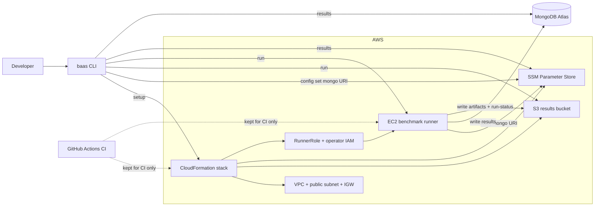
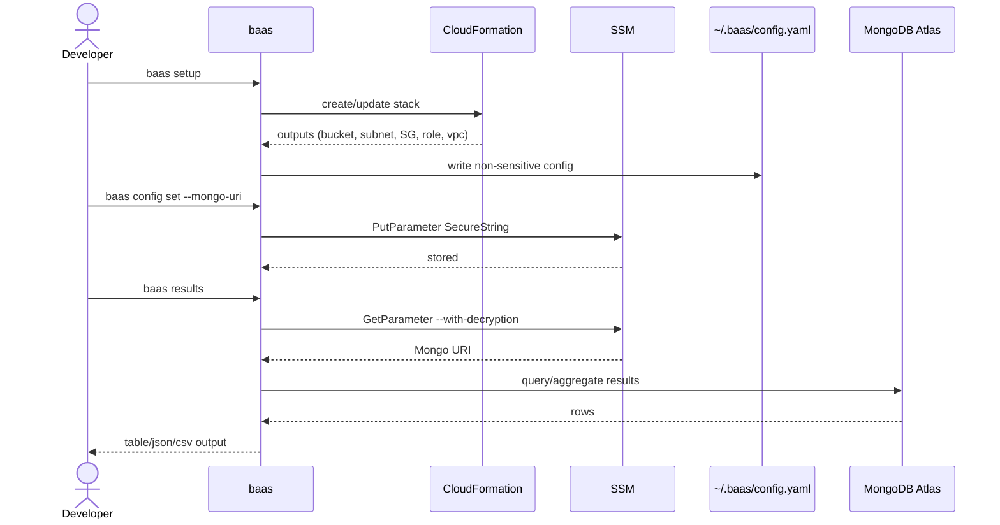
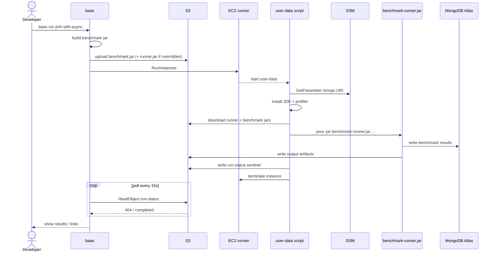
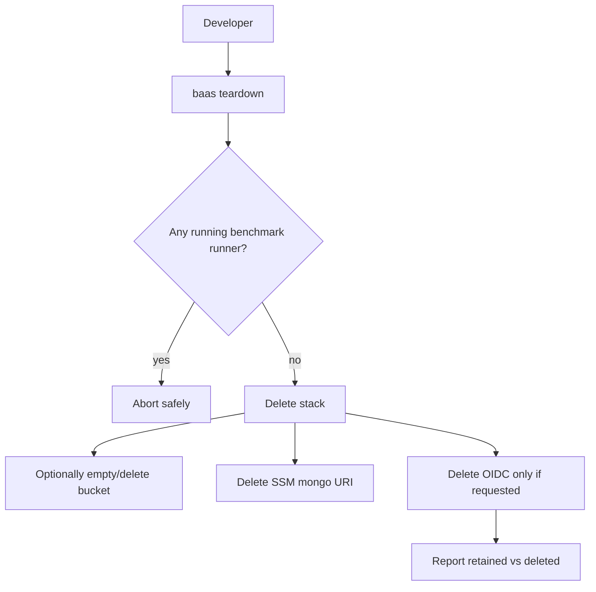

# BaaS Redesign Diagrams

## 1. High-level component flow

```mermaid
flowchart LR
  Dev[Developer] --> CLI[baas CLI]

  subgraph AWS[AWS]
    CF[CloudFormation stack]
    VPC[VPC + public subnet + IGW]
    S3[S3 results bucket]
    SSM[SSM Parameter Store]
    IAM[RunnerRole + operator IAM]
    EC2[EC2 benchmark runner]
  end

  CLI -->|setup| CF
  CLI -->|config set mongo URI| SSM
  CLI -->|run| S3
  CLI -->|run| EC2
  CLI -->|results| SSM
  CLI -->|results| Mongo[(MongoDB Atlas)]

  CF --> VPC
  CF --> S3
  CF --> SSM
  CF --> IAM
  IAM --> EC2
  EC2 -->|fetch mongo URI| SSM
  EC2 -->|write results| Mongo
  EC2 -->|write artifacts + run-status| S3

  GHA[GitHub Actions CI] -.->|kept for CI only| CF
  GHA -.->|kept for CI only| EC2
```

## 2. Setup, config, and results

```mermaid
sequenceDiagram
  actor D as Developer
  participant B as baas
  participant C as CloudFormation
  participant S as SSM
  participant F as ~/.baas/config.yaml
  participant M as MongoDB Atlas

  D->>B: baas setup
  B->>C: create/update stack
  C-->>B: outputs (bucket, subnet, SG, role, vpc)
  B->>F: write non-sensitive config

  D->>B: baas config set --mongo-uri
  B->>S: PutParameter SecureString
  S-->>B: stored

  D->>B: baas results
  B->>S: GetParameter --with-decryption
  S-->>B: Mongo URI
  B->>M: query/aggregate results
  M-->>B: rows
  B-->>D: table/json/csv output
```

## 3. Benchmark run flow

```mermaid
sequenceDiagram
  actor D as Developer
  participant B as baas
  participant S3 as S3
  participant EC2 as EC2 runner
  participant UD as user-data script
  participant SSM as SSM
  participant BR as benchmark-runner.jar
  participant M as MongoDB Atlas

  D->>B: baas run jmh-with-async
  B->>B: build benchmark jar
  B->>S3: upload benchmark.jar (+ runner.jar if overridden)
  B->>EC2: RunInstances
  EC2-->>UD: start user-data

  UD->>SSM: GetParameter mongo URI
  UD->>UD: install JDK + profiler
  UD->>S3: download runner + benchmark jars
  UD->>BR: java -jar benchmark-runner.jar ...
  BR->>M: write benchmark results
  BR->>S3: write output artifacts
  UD->>S3: write run-status sentinel
  UD->>EC2: terminate instance

  loop poll every 15s
    B->>S3: HeadObject run-status
    S3-->>B: 404 / completed
  end

  B-->>D: show results / links
```

## 4. Safe teardown flow

```mermaid
flowchart TD
  D[Developer] --> T[baas teardown]
  T --> G{Any running benchmark runner?}
  G -- yes --> A[Abort safely]
  G -- no --> C[Delete stack]
  C --> B[Optionally empty/delete bucket]
  C --> S[Delete SSM mongo URI]
  C --> O[Delete OIDC only if requested]
  O --> R[Report retained vs deleted]
```
