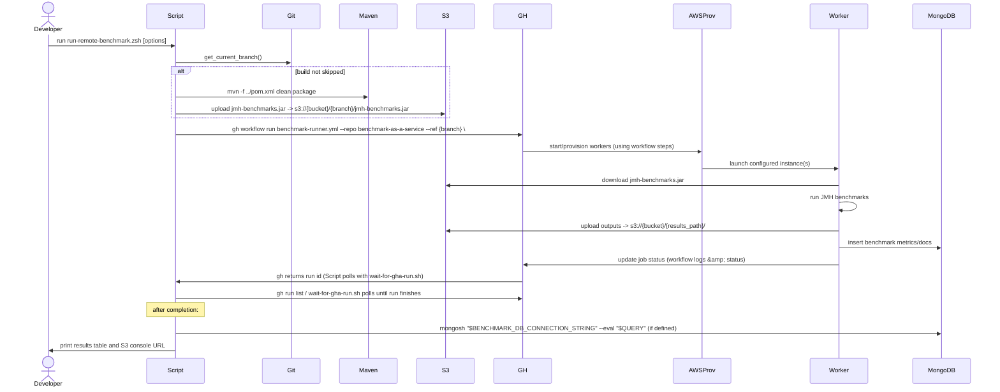

```mermaid
sequenceDiagram
actor Developer
participant Script
participant Git
participant Maven
participant S3
participant GH
participant AWSProv
participant Worker
participant MongoDB
Developer->>Script: run run-remote-benchmark.zsh [options]
Script->>Git: get_current_branch#40;#41;
alt build not skipped
Script->>Maven: mvn -f ../pom.xml clean package
Script->>S3: upload jmh-benchmarks.jar -> s3://{bucket}/{branch}/jmh-benchmarks.jar
end
Script->>GH: gh workflow run benchmark-runner.yml --repo benchmark-as-a-service --ref {branch} \
GH->>AWSProv: start/provision workers #40;using workflow steps#41;
AWSProv->>Worker: launch configured instance#40;s#41;
Worker->>S3: download jmh-benchmarks.jar
Worker->>Worker: run JMH benchmarks
Worker->>S3: upload outputs -> s3://{bucket}/{results_path}/
Worker->>MongoDB: insert benchmark metrics/docs
Worker->>GH: update job status #40;workflow logs &amp#59; status#41;
GH->>Script: gh returns run id #40;Script polls with wait-for-gha-run.sh#41;
Script->>GH: gh run list / wait-for-gha-run.sh polls until run finishes
Note over Script: after completion:
Script->>MongoDB: mongosh "$BENCHMARK_DB_CONNECTION_STRING" --eval "$QUERY" #40;if defined#41;
Script->>Developer: print results table and S3 console URL
```