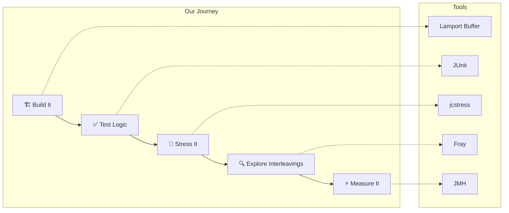
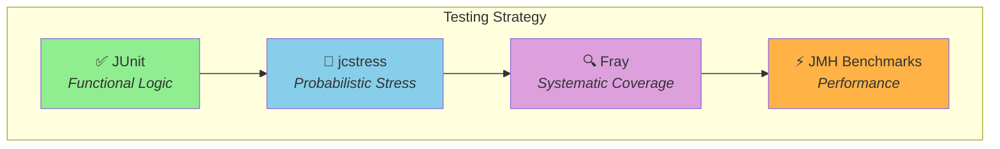

# Testing Concurrent Algorithms in Java
## A Journey Through Lamport's Circular Buffer

**Duration:** ~45 minutes

---

## Presentation Overview

This presentation explores four complementary approaches to testing concurrent algorithms in Java, using **Lamport's Circular Buffer** as a running example throughout.

### The Story Arc



---

## Agenda

| Part | Topic | Time | Focus |
|------|-------|------|-------|
| **Intro** | Lamport's Circular Buffer | 5 min | Algorithm & Implementation |
| **Part 1** | Single-Threaded Unit Tests | 8 min | Functional Correctness |
| **Part 2** | jcstress-based Tests | 12 min | Probabilistic Concurrency Testing |
| **Part 3** | Fray-based Tests | 10 min | Systematic Interleaving Exploration |
| **Part 4** | JMH Benchmarks | 8 min | Performance Measurement |
| **Wrap-up** | Testing Pyramid for Concurrency | 2 min | Summary & Best Practices |

---

## Learning Outcomes

By the end of this presentation, you will understand:

1. **Why single-threaded tests are necessary but insufficient** for concurrent code
2. **How jcstress finds race conditions** through massive stress testing
3. **How Fray systematically explores** thread interleavings for guaranteed coverage
4. **How JMH measures performance** of concurrent algorithms
5. **When to use each tool** in your testing strategy

---

## The Testing Pyramid for Concurrency



---

## Prerequisites

- Basic Java knowledge
- Understanding of threads and synchronization concepts
- Familiarity with JUnit testing

---

## Repository Structure

```
presentation/
├── 00-overview.md          # This file
├── 01-lamport-buffer.md    # Introduction to Lamport's Buffer
├── 02-unit-tests.md        # Part 1: Single-threaded tests
├── 03-jcstress.md          # Part 2: jcstress testing
├── 04-fray.md              # Part 3: Fray testing
├── 05-jmh.md               # Part 4: JMH benchmarks
└── 06-summary.md           # Wrap-up and conclusions
```

