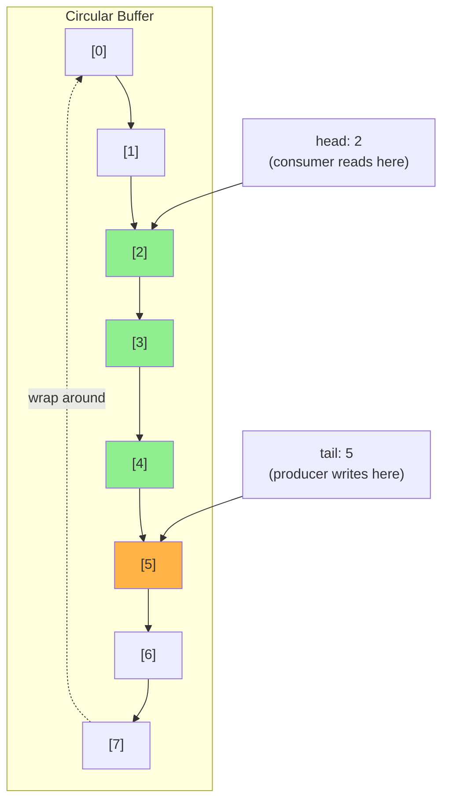
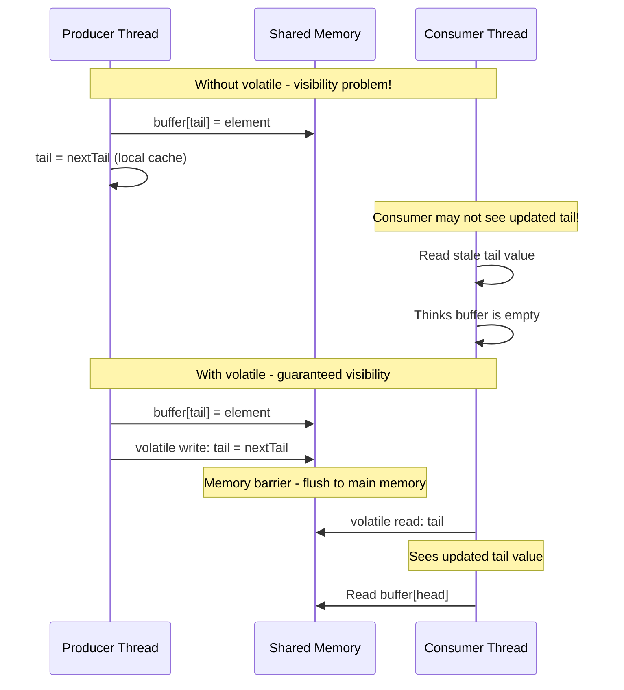

# Introduction: Lamport's Circular Buffer
## Duration: ~5 minutes

---

## What is Lamport's Circular Buffer?

A **lock-free, wait-free** queue designed for the **Single-Producer, Single-Consumer (SPSC)** scenario.

### Key Properties

- 📝 **One writer thread** (producer) adds elements
- 📖 **One reader thread** (consumer) removes elements
- 🔓 **No locks required** - uses only volatile variables
- ⚡ **Minimal synchronization overhead**

---

## The Algorithm



**Invariants:**
- `head` points to the next element to be consumed
- `tail` points to the next slot for production
- Buffer is **empty** when `head == tail`
- Buffer is **full** when `(tail + 1) % capacity == head`

---

## Basic Implementation

```java
public class LamportBuffer<E> {
    private final E[] buffer;
    private final int capacity;
    
    // Volatile ensures visibility across threads
    private volatile int head = 0;  // Consumer reads from here
    private volatile int tail = 0;  // Producer writes here
    
    @SuppressWarnings("unchecked")
    public LamportBuffer(int capacity) {
        this.capacity = capacity;
        this.buffer = (E[]) new Object[capacity];
    }
    
    /**
     * Producer: Add element to buffer
     * @return true if successful, false if buffer is full
     */
    public boolean offer(E element) {
        int currentTail = tail;
        int nextTail = (currentTail + 1) % capacity;
        
        if (nextTail == head) {
            return false; // Buffer is full
        }
        
        buffer[currentTail] = element;
        tail = nextTail; // Volatile write - publishes the element
        return true;
    }
    
    /**
     * Consumer: Remove element from buffer
     * @return element if available, null if buffer is empty
     */
    public E poll() {
        int currentHead = head;
        
        if (currentHead == tail) {
            return null; // Buffer is empty
        }
        
        E element = buffer[currentHead];
        buffer[currentHead] = null; // Help GC
        head = (currentHead + 1) % capacity; // Volatile write
        return element;
    }
    
    public boolean isEmpty() {
        return head == tail;
    }
    
    public int size() {
        int diff = tail - head;
        return diff >= 0 ? diff : diff + capacity;
    }
}
```

---

## Why Volatile Matters



---

## Concurrency Invariants to Test

| Invariant | Description |
|-----------|-------------|
| **FIFO Order** | Elements come out in the same order they went in |
| **No Lost Elements** | Every produced element can be consumed |
| **No Duplicate Reads** | Each element is consumed exactly once |
| **No Buffer Overflow** | Producer respects capacity limit |
| **Visibility** | Consumer sees all data written by producer |

---

## Why This Example?

Lamport's buffer is ideal for our presentation because:

1. **Simple enough** to understand in 5 minutes
2. **Complex enough** to have real concurrency bugs if implemented wrong
3. **Uses core primitives** (`volatile`, memory barriers)
4. **Demonstrates all testing needs**:
   - Unit tests: basic functionality
   - jcstress: race conditions & visibility
   - Fray: systematic exploration
   - JMH: performance measurement

---

## The Testing Challenge

> "How do we know our implementation is correct?"

Single-threaded tests will pass even with broken concurrent code!

```java
// This test always passes - even if visibility is broken!
@Test
void testSimpleProduceConsume() {
    var buffer = new LamportBuffer<Integer>(4);
    buffer.offer(42);
    assertEquals(42, buffer.poll());
}
```

**Next:** Let's build proper tests, starting with single-threaded scenarios.

