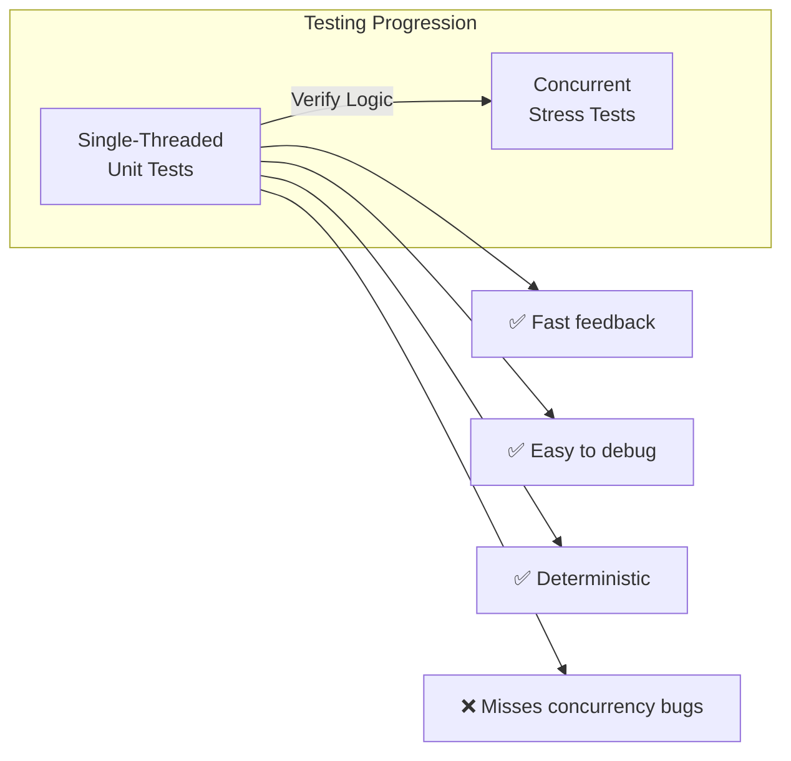
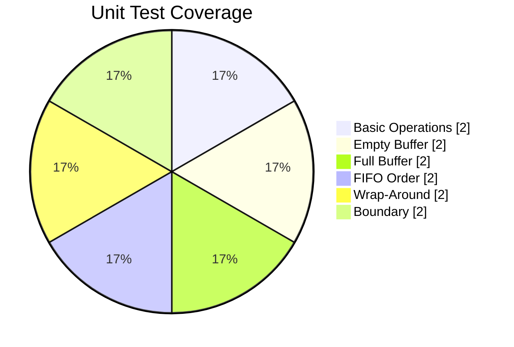
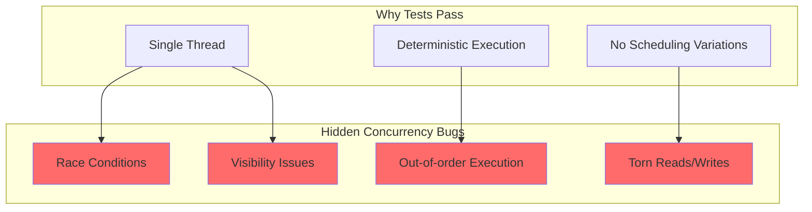

# Part 1: Single-Threaded Unit Tests
## Duration: ~8 minutes

---

## Why Start with Unit Tests?



**Key Point:** Unit tests verify *sequential semantics* - the algorithm's logic works correctly when there's no concurrency.

---

## Test Categories

| Category | What We Test | Example |
|----------|--------------|---------|
| **Basic Operations** | offer/poll work | Produce 1, consume 1 |
| **Empty Buffer** | poll on empty | Returns null |
| **Full Buffer** | offer on full | Returns false |
| **FIFO Order** | Order preserved | 1,2,3 → 1,2,3 |
| **Wrap-Around** | Circular behavior | Fill, drain, fill again |
| **Boundary** | Edge cases | Capacity limits |

---

## Test Setup

```java
import org.junit.jupiter.api.BeforeEach;
import org.junit.jupiter.api.Test;
import org.junit.jupiter.api.DisplayName;
import static org.junit.jupiter.api.Assertions.*;

class LamportBufferUnitTest {
    
    private static final int CAPACITY = 8;
    private LamportBuffer<Integer> buffer;
    
    @BeforeEach
    void setUp() {
        buffer = new LamportBuffer<>(CAPACITY);
    }
    
    // Tests follow...
}
```

---

## Basic Operations Tests

```java
@Test
@DisplayName("Offer and poll single element")
void testBasicOfferAndPoll() {
    // Given
    Integer element = 42;
    
    // When
    boolean offered = buffer.offer(element);
    Integer polled = buffer.poll();
    
    // Then
    assertTrue(offered, "Offer should succeed on empty buffer");
    assertEquals(element, polled, "Polled element should match offered");
}

@Test
@DisplayName("New buffer should be empty")
void testNewBufferIsEmpty() {
    assertTrue(buffer.isEmpty());
    assertEquals(0, buffer.size());
}
```

---

## Empty Buffer Tests

```java
@Test
@DisplayName("Poll on empty buffer returns null")
void testPollOnEmpty() {
    // Given: empty buffer (setUp creates empty buffer)
    
    // When
    Integer result = buffer.poll();
    
    // Then
    assertNull(result, "Poll on empty buffer should return null");
    assertTrue(buffer.isEmpty(), "Buffer should remain empty");
}

@Test
@DisplayName("Multiple polls on empty buffer")
void testMultiplePollsOnEmpty() {
    assertAll(
        () -> assertNull(buffer.poll()),
        () -> assertNull(buffer.poll()),
        () -> assertNull(buffer.poll()),
        () -> assertTrue(buffer.isEmpty())
    );
}
```

---

## Full Buffer Tests

```java
@Test
@DisplayName("Offer on full buffer returns false")
void testOfferOnFull() {
    // Given: fill the buffer (capacity - 1 elements)
    for (int i = 0; i < CAPACITY - 1; i++) {
        assertTrue(buffer.offer(i), "Offer " + i + " should succeed");
    }
    
    // When: try to add one more
    boolean result = buffer.offer(999);
    
    // Then
    assertFalse(result, "Offer on full buffer should return false");
    assertEquals(CAPACITY - 1, buffer.size());
}

@Test
@DisplayName("Buffer capacity is capacity-1 due to sentinel")
void testEffectiveCapacity() {
    int count = 0;
    while (buffer.offer(count)) {
        count++;
    }
    
    // Lamport buffer sacrifices one slot to distinguish empty from full
    assertEquals(CAPACITY - 1, count, 
        "Effective capacity should be capacity - 1");
}
```

---

## FIFO Order Tests

```java
@Test
@DisplayName("Elements maintain FIFO order")
void testFifoOrder() {
    // Given
    List<Integer> input = List.of(1, 2, 3, 4, 5);
    
    // When: produce all
    input.forEach(buffer::offer);
    
    // Then: consume in same order
    List<Integer> output = new ArrayList<>();
    Integer element;
    while ((element = buffer.poll()) != null) {
        output.add(element);
    }
    
    assertEquals(input, output, "Order should be preserved (FIFO)");
}

@Test
@DisplayName("Interleaved produce-consume maintains order")
void testInterleavedFifo() {
    buffer.offer(1);
    buffer.offer(2);
    assertEquals(1, buffer.poll());
    
    buffer.offer(3);
    assertEquals(2, buffer.poll());
    assertEquals(3, buffer.poll());
    
    assertNull(buffer.poll());
}
```

---

## Wrap-Around Tests

```java
@Test
@DisplayName("Buffer handles wrap-around correctly")
void testWrapAround() {
    // Fill and drain multiple times to trigger wrap-around
    for (int round = 0; round < 3; round++) {
        // Fill
        for (int i = 0; i < CAPACITY - 1; i++) {
            assertTrue(buffer.offer(round * 100 + i));
        }
        
        // Drain
        for (int i = 0; i < CAPACITY - 1; i++) {
            assertEquals(round * 100 + i, buffer.poll());
        }
        
        assertTrue(buffer.isEmpty());
    }
}

@Test
@DisplayName("Partial fill and drain with wrap-around")
void testPartialWrapAround() {
    // Offset the head/tail pointers
    for (int i = 0; i < 5; i++) {
        buffer.offer(i);
        buffer.poll();
    }
    
    // Now fill - should wrap around
    for (int i = 0; i < CAPACITY - 1; i++) {
        assertTrue(buffer.offer(i * 10));
    }
    
    // Verify order
    for (int i = 0; i < CAPACITY - 1; i++) {
        assertEquals(i * 10, buffer.poll());
    }
}
```

---

## Boundary Tests

```java
@Test
@DisplayName("Minimum capacity buffer works")
void testMinimumCapacity() {
    LamportBuffer<String> small = new LamportBuffer<>(2);
    
    assertTrue(small.offer("A"));
    assertFalse(small.offer("B")); // Capacity is 2-1=1
    
    assertEquals("A", small.poll());
    assertNull(small.poll());
}

@Test
@DisplayName("Size reflects current state")
void testSizeAccuracy() {
    assertEquals(0, buffer.size());
    
    buffer.offer(1);
    assertEquals(1, buffer.size());
    
    buffer.offer(2);
    buffer.offer(3);
    assertEquals(3, buffer.size());
    
    buffer.poll();
    assertEquals(2, buffer.size());
}
```

---

## Null Handling Test

```java
@Test
@DisplayName("Buffer can store null values")
void testNullValues() {
    // Note: This might be a design decision - allow or reject nulls?
    buffer.offer(1);
    buffer.offer(null);  // Storing null
    buffer.offer(3);
    
    assertEquals(1, buffer.poll());
    assertNull(buffer.poll()); // Is this null value or empty buffer?
    assertEquals(3, buffer.poll());
}
```

**⚠️ Design Question:** Should the buffer allow null values? 
- If yes: need a different way to signal "empty"
- If no: add null check in `offer()`

---

## Test Results Visualization



---

## What Unit Tests DON'T Catch



---

## The False Sense of Security

```java
// BROKEN implementation - missing volatile!
public class BrokenLamportBuffer<E> {
    private final E[] buffer;
    private int head = 0;  // NOT volatile - bug!
    private int tail = 0;  // NOT volatile - bug!
    
    // ... same methods as before ...
}
```

All our unit tests would **still pass** with this broken implementation!

```
✅ testBasicOfferAndPoll - PASSED
✅ testPollOnEmpty - PASSED
✅ testOfferOnFull - PASSED
✅ testFifoOrder - PASSED
✅ testWrapAround - PASSED
...
```

**The bug only manifests under concurrent execution.**

---

## Key Takeaways - Part 1

1. ✅ **Unit tests verify logic** - essential foundation
2. ✅ **Fast feedback loop** - run in milliseconds  
3. ✅ **Easy to debug** - deterministic, reproducible
4. ❌ **Blind to concurrency** - all tests pass even with race conditions
5. 📌 **Next step needed** - stress testing with multiple threads

---

## Transition to Part 2

> "Our unit tests pass, but we haven't tested with actual concurrent threads. How do we stress-test the buffer with producer and consumer running simultaneously?"

**Next:** Enter **jcstress** - OpenJDK's Java Concurrency Stress testing framework.

