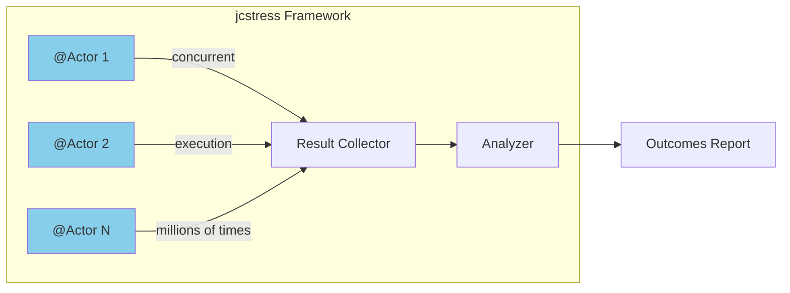
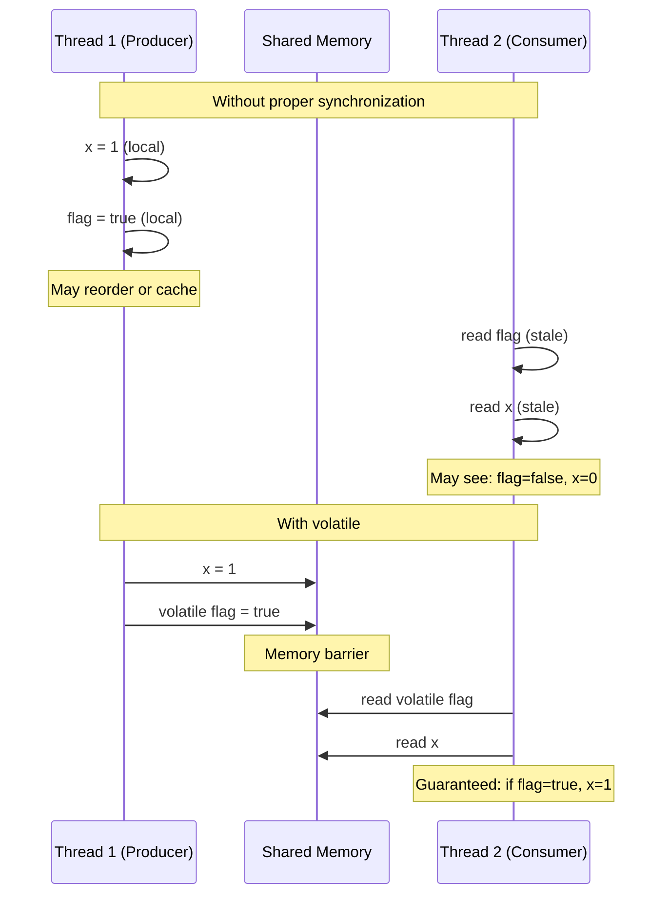
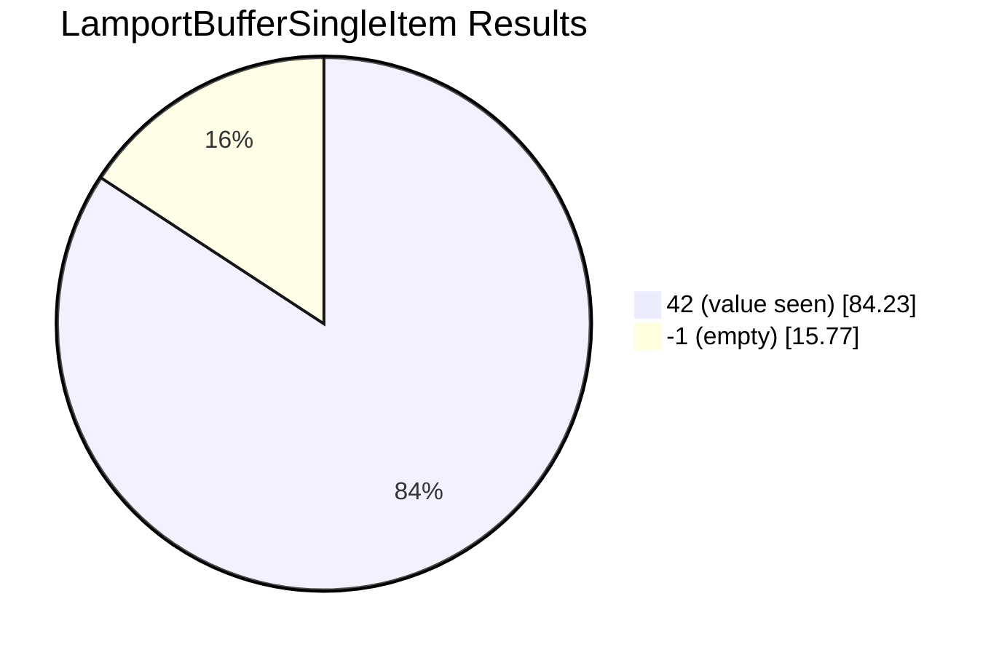
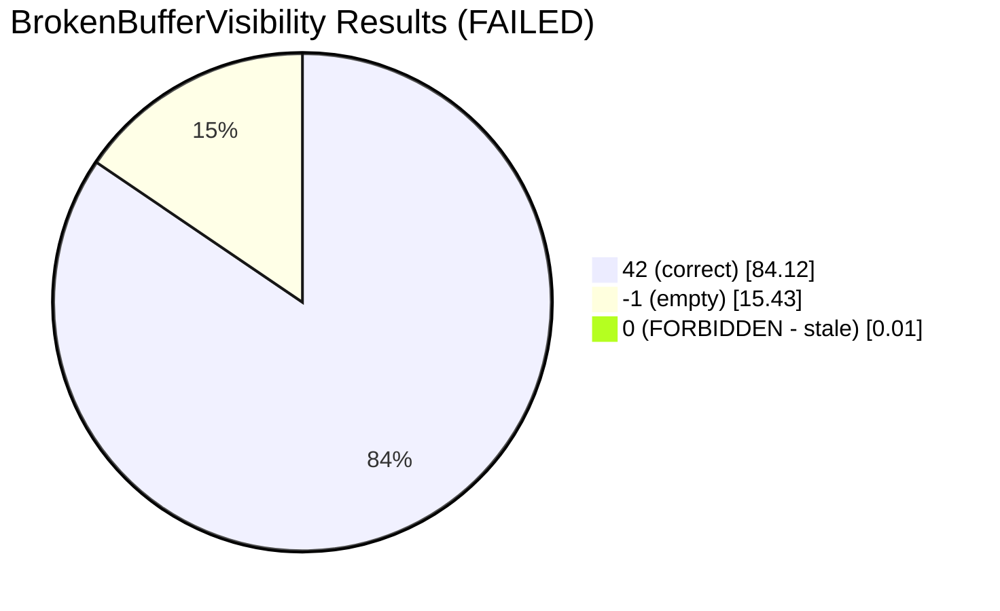
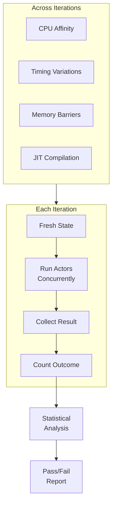

# Part 2: jcstress-based Tests
## Duration: ~12 minutes

---

## What is jcstress?

**Java Concurrency Stress tests** - an experimental harness and test suite from OpenJDK.



**Key Features:**
- Runs tests millions of times with different thread interleavings
- Varies CPU affinity, timing, and scheduling
- Statistically analyzes outcomes
- Designed specifically for JVM concurrency testing

---

## Why jcstress?

| Traditional Concurrency Test | jcstress |
|------------------------------|----------|
| Runs once or few times | Runs millions of iterations |
| Hope to hit race condition | Systematically varies timing |
| Flaky, hard to reproduce | Statistical outcome analysis |
| "It works on my machine" | Tests real hardware behavior |

---

## Quick Java Memory Model Primer



**Happens-Before:** A volatile write *happens-before* subsequent volatile reads.

---

## jcstress Test Structure

```java
@JCStressTest
@Outcome(id = "1", expect = Expect.ACCEPTABLE, desc = "Correct read")
@Outcome(id = "0", expect = Expect.FORBIDDEN, desc = "Visibility bug!")
@State
public class MyFirstJCStressTest {
    
    int value = 0;
    volatile boolean ready = false;
    
    @Actor
    public void producer() {
        value = 1;
        ready = true;
    }
    
    @Actor
    public void consumer(I_Result r) {
        if (ready) {
            r.r1 = value;  // Should always see 1
        } else {
            r.r1 = -1;  // Not ready yet
        }
    }
}
```

---

## Key Annotations

| Annotation | Purpose |
|------------|---------|
| `@JCStressTest` | Marks class as a jcstress test |
| `@State` | Shared state between actors |
| `@Actor` | Method runs in its own thread, concurrently with other actors |
| `@Arbiter` | Runs after all actors complete (for final observation) |
| `@Outcome` | Declares expected/forbidden results |

### Outcome Expectations

| Expect | Meaning |
|--------|---------|
| `ACCEPTABLE` | Valid outcome |
| `ACCEPTABLE_INTERESTING` | Valid but worth noting |
| `FORBIDDEN` | Should never happen - test fails if seen |
| `UNKNOWN` | Not explicitly categorized |

---

## Testing Lamport Buffer with jcstress

### Test 1: Basic Producer-Consumer

```java
@JCStressTest
@Outcome(id = "42", expect = Expect.ACCEPTABLE, desc = "Consumer saw the value")
@Outcome(id = "-1", expect = Expect.ACCEPTABLE, desc = "Consumer ran first, buffer empty")
@Outcome(id = "0", expect = Expect.FORBIDDEN, desc = "Visibility bug - saw partial state")
@State
public class LamportBufferSingleItem {
    
    private final LamportBuffer<Integer> buffer = new LamportBuffer<>(4);
    
    @Actor
    public void producer() {
        buffer.offer(42);
    }
    
    @Actor
    public void consumer(I_Result r) {
        Integer result = buffer.poll();
        r.r1 = (result == null) ? -1 : result;
    }
}
```

---

## Test 2: FIFO Order Under Concurrency

```java
@JCStressTest
@Outcome(id = "1, 2", expect = Expect.ACCEPTABLE, desc = "Both consumed in order")
@Outcome(id = "1, -1", expect = Expect.ACCEPTABLE, desc = "Only first consumed")
@Outcome(id = "-1, -1", expect = Expect.ACCEPTABLE, desc = "Nothing consumed yet")
@Outcome(id = "-1, 2", expect = Expect.FORBIDDEN, desc = "Second without first - order violated!")
@Outcome(id = "2, 1", expect = Expect.FORBIDDEN, desc = "Wrong order!")
@Outcome(id = "2, 2", expect = Expect.FORBIDDEN, desc = "Duplicate read!")
@State
public class LamportBufferFifoOrder {
    
    private final LamportBuffer<Integer> buffer = new LamportBuffer<>(4);
    
    @Actor
    public void producer() {
        buffer.offer(1);
        buffer.offer(2);
    }
    
    @Actor
    public void consumer(II_Result r) {
        Integer first = buffer.poll();
        Integer second = buffer.poll();
        r.r1 = (first == null) ? -1 : first;
        r.r2 = (second == null) ? -1 : second;
    }
}
```

---

## Test 3: No Lost Elements

```java
@JCStressTest
@Outcome(id = "3", expect = Expect.ACCEPTABLE, desc = "All elements consumed")
@State
public class LamportBufferNoLoss {
    
    private final LamportBuffer<Integer> buffer = new LamportBuffer<>(8);
    
    @Actor
    public void producer() {
        buffer.offer(1);
        buffer.offer(2);
        buffer.offer(3);
    }
    
    @Arbiter  // Runs AFTER both actors complete
    public void arbiter(I_Result r) {
        int count = 0;
        while (buffer.poll() != null) {
            count++;
        }
        r.r1 = count;
    }
}
```

---

## Test 4: Full Buffer Rejection

```java
@JCStressTest
@Outcome(id = "true, false", expect = Expect.ACCEPTABLE, desc = "First succeeded, second rejected")
@Outcome(id = "true, true", expect = Expect.FORBIDDEN, desc = "Both succeeded - overflow!")
@State
public class LamportBufferCapacity {
    
    // Capacity 2 means only 1 slot available
    private final LamportBuffer<Integer> buffer = new LamportBuffer<>(2);
    
    @Actor
    public void producer1(ZZ_Result r) {
        r.r1 = buffer.offer(1);
    }
    
    @Actor
    public void producer2(ZZ_Result r) {
        r.r2 = buffer.offer(2);
    }
}
```

**Wait!** ⚠️ This test violates SPSC assumption - two producers!
This should fail or be redesigned for SPSC.

---

## Detecting the Missing Volatile Bug

```java
// BROKEN: head and tail are NOT volatile
public class BrokenLamportBuffer<E> {
    private int head = 0;  // Bug: not volatile
    private int tail = 0;  // Bug: not volatile
    // ...
}
```

```java
@JCStressTest
@Outcome(id = "42", expect = Expect.ACCEPTABLE, desc = "Correct")
@Outcome(id = "-1", expect = Expect.ACCEPTABLE, desc = "Not yet visible - timing")
@Outcome(id = "0", expect = Expect.ACCEPTABLE_INTERESTING, 
         desc = "Saw stale data - visibility bug!")
@State
public class BrokenBufferVisibility {
    
    private final BrokenLamportBuffer<Integer> buffer = 
        new BrokenLamportBuffer<>(4);
    
    @Actor
    public void producer() {
        buffer.offer(42);
    }
    
    @Actor
    public void consumer(I_Result r) {
        Integer result = buffer.poll();
        r.r1 = (result == null) ? -1 : result;
    }
}
```

---

## Running jcstress

### Maven Setup

```xml
<dependency>
    <groupId>org.openjdk.jcstress</groupId>
    <artifactId>jcstress-core</artifactId>
    <version>0.16</version>
</dependency>

<plugin>
    <groupId>org.apache.maven.plugins</groupId>
    <artifactId>maven-shade-plugin</artifactId>
    <configuration>
        <transformers>
            <transformer implementation="org.apache.maven.plugins.shade.resource.ManifestResourceTransformer">
                <mainClass>org.openjdk.jcstress.Main</mainClass>
            </transformer>
        </transformers>
    </configuration>
</plugin>
```

### Running

```bash
# Build
mvn clean package

# Run all tests
java -jar target/jcstress.jar

# Run specific test
java -jar target/jcstress.jar -t "LamportBuffer.*"

# Quick sanity run
java -jar target/jcstress.jar -m sanity
```

---

## Understanding jcstress Output

```
*** INTERESTING tests
  Some interesting behaviors observed. This is for the plain curiosity.

  2 matching test results.

  [OK] LamportBufferSingleItem
    Observed states:
         42   (84,234,891 occurrences, 84.23%)
         -1   (15,765,109 occurrences, 15.77%)

  [FAILED] BrokenBufferVisibility
    Observed states:
         42   (84,123,456 occurrences, 84.12%)
         -1   (15,432,123 occurrences, 15.43%)
          0   (     4,421 occurrences,  0.01%)  <-- FORBIDDEN!
```

---

## Outcome Visualization





Even 0.01% forbidden outcomes = **FAILED TEST**

---

## jcstress Execution Model



---

## jcstress Strengths

| Strength | Description |
|----------|-------------|
| 🔥 **Massive Iteration** | Millions of runs find rare bugs |
| 🖥️ **Real Hardware** | Tests actual CPU/JVM behavior |
| 📊 **Statistical** | Quantifies how often issues occur |
| 🎯 **JVM-Specific** | Understands Java Memory Model |
| 🏃 **Fast Execution** | Highly optimized harness |

---

## jcstress Limitations

| Limitation | Description |
|------------|-------------|
| 🎲 **Probabilistic** | May miss rare interleavings |
| ❓ **No Guarantees** | "No bugs found" ≠ "No bugs exist" |
| 🔀 **Random Scheduling** | Can't explore all paths |
| 🔁 **Not Reproducible** | Hard to replay exact failure |

---

## Key Takeaways - Part 2

1. ✅ **jcstress finds real concurrency bugs** through stress testing
2. ✅ **Statistical analysis** quantifies bug frequency
3. ✅ **Tests real JVM behavior** - not a simulation
4. ⚠️ **Probabilistic** - may miss some interleavings
5. 📌 **Next question**: Can we systematically explore ALL interleavings?

---

## Transition to Part 3

> "jcstress found bugs our unit tests missed, but it's probabilistic. What if the bug only occurs with one specific thread schedule out of millions? Can we systematically explore all possible interleavings?"

**Next:** Enter **Fray** - Microsoft Research's systematic concurrency testing tool.

