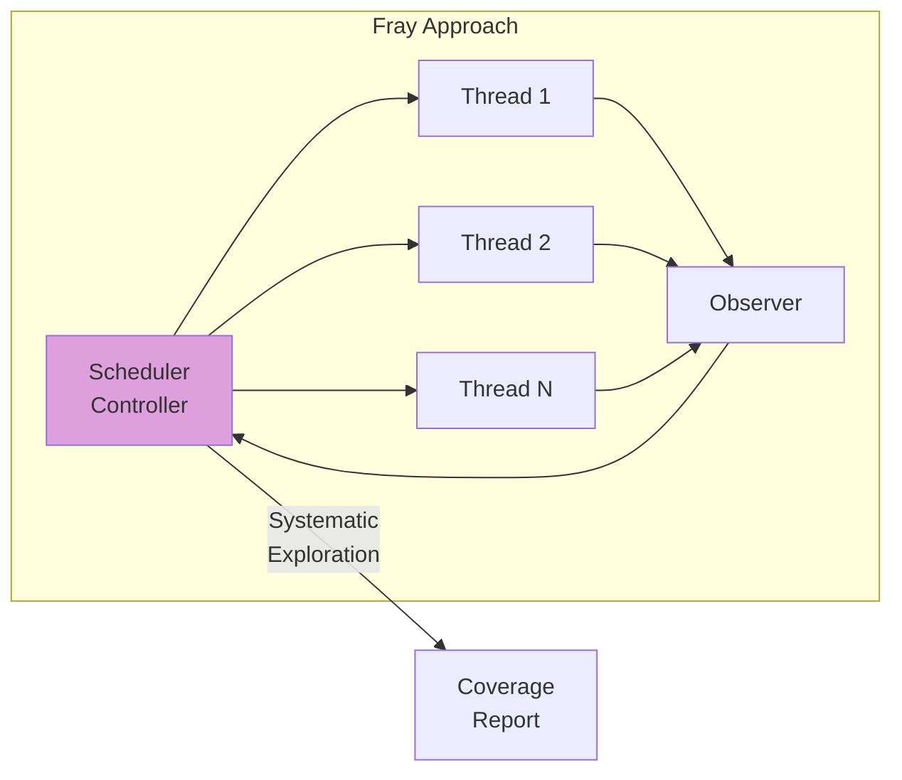
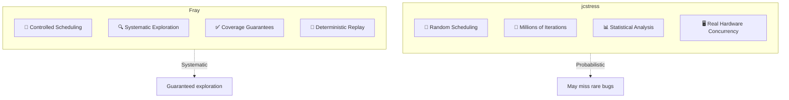
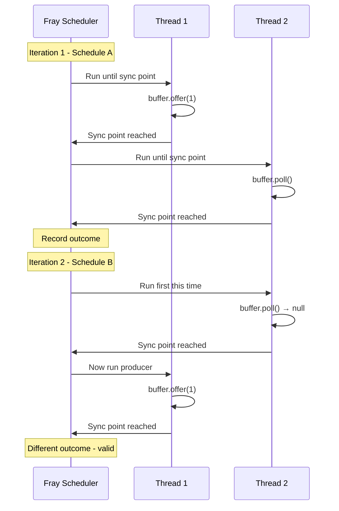
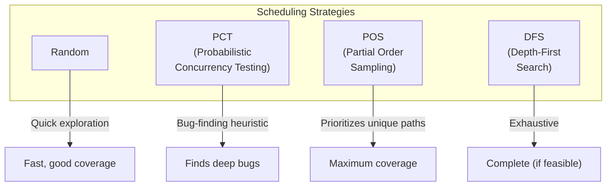
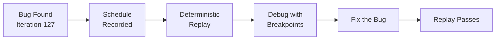
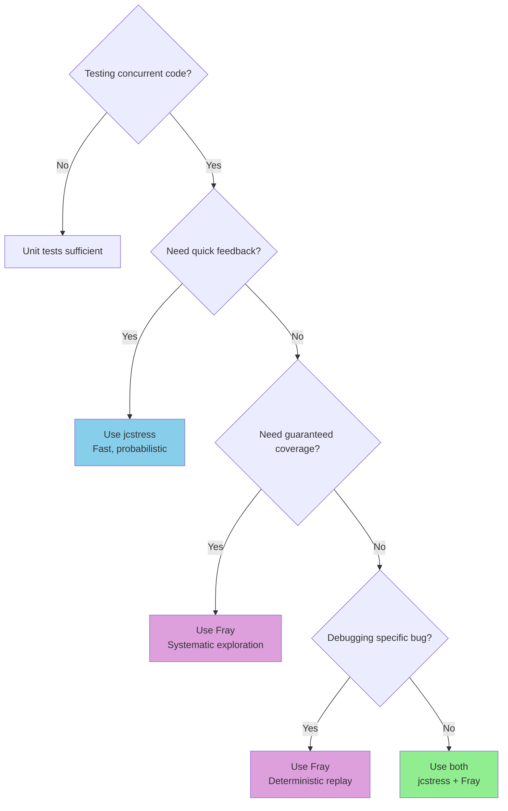
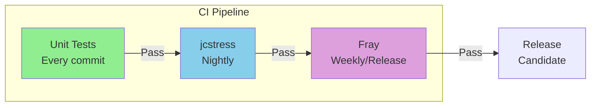

# Part 3: Fray-based Tests
## Duration: ~10 minutes

---

## What is Fray?

**Fray** is a systematic concurrency testing tool from Microsoft Research that uses **controlled concurrency testing (CCT)** to explore thread interleavings.



**Key Difference:** Fray **controls** thread scheduling, systematically exploring different execution orders.

---

## jcstress vs Fray: Approaches Compared



---

## Comparison Table

| Aspect | jcstress | Fray |
|--------|----------|------|
| **Approach** | Probabilistic stress | Systematic exploration |
| **Scheduling** | Real OS scheduler | Controlled scheduler |
| **Coverage** | Statistical confidence | Bounded exhaustive |
| **Speed** | Very fast | Slower (explores paths) |
| **Reproducibility** | Hard to reproduce | Deterministic replay |
| **Bug Discovery** | "Probably works" | "Proven for N interleavings" |
| **Memory Model** | Tests real JVM/CPU | Simulated (sequentially consistent) |

---

## How Fray Works



---

## Setting Up Fray

### Maven Dependency

```xml
<dependency>
    <groupId>org.pastalab</groupId>
    <artifactId>fray-junit</artifactId>
    <version>0.2.2</version>
    <scope>test</scope>
</dependency>
```

### JVM Agent Configuration

```bash
# Fray requires a Java agent for bytecode instrumentation
java -javaagent:fray-agent.jar \
     -Dfray.scheduler=random \
     -Dfray.iterations=1000 \
     -jar your-tests.jar
```

---

## Fray Test for Lamport Buffer

```java
import org.pastalab.fray.junit.FrayTest;
import org.pastalab.fray.junit.annotations.ConcurrentTest;
import static org.junit.jupiter.api.Assertions.*;

public class LamportBufferFrayTest {
    
    @ConcurrentTest(iterations = 1000)
    public void testProducerConsumer() throws InterruptedException {
        LamportBuffer<Integer> buffer = new LamportBuffer<>(4);
        AtomicReference<Integer> consumed = new AtomicReference<>();
        
        Thread producer = new Thread(() -> {
            buffer.offer(42);
        });
        
        Thread consumer = new Thread(() -> {
            Integer result = buffer.poll();
            consumed.set(result);
        });
        
        producer.start();
        consumer.start();
        
        producer.join();
        consumer.join();
        
        // Either consumer saw the value, or it was empty (ran first)
        Integer result = consumed.get();
        assertTrue(result == null || result == 42,
            "Unexpected value: " + result);
    }
}
```

---

## Testing FIFO Order with Fray

```java
@ConcurrentTest(iterations = 1000)
public void testFifoOrderPreserved() throws InterruptedException {
    LamportBuffer<Integer> buffer = new LamportBuffer<>(8);
    List<Integer> consumed = Collections.synchronizedList(new ArrayList<>());
    
    Thread producer = new Thread(() -> {
        for (int i = 1; i <= 5; i++) {
            while (!buffer.offer(i)) {
                Thread.yield();
            }
        }
    });
    
    Thread consumer = new Thread(() -> {
        int count = 0;
        while (count < 5) {
            Integer val = buffer.poll();
            if (val != null) {
                consumed.add(val);
                count++;
            } else {
                Thread.yield();
            }
        }
    });
    
    producer.start();
    consumer.start();
    producer.join();
    consumer.join();
    
    // Verify FIFO order
    assertEquals(List.of(1, 2, 3, 4, 5), consumed,
        "Elements must be consumed in FIFO order");
}
```

---

## Detecting Visibility Bugs with Fray

```java
@ConcurrentTest(iterations = 1000)
public void testVisibilityWithBrokenBuffer() throws InterruptedException {
    BrokenLamportBuffer<Integer> buffer = new BrokenLamportBuffer<>(4);
    AtomicInteger result = new AtomicInteger(-999);
    AtomicBoolean sawPartialState = new AtomicBoolean(false);
    
    Thread producer = new Thread(() -> {
        buffer.offer(42);
    });
    
    Thread consumer = new Thread(() -> {
        // Might see partial state without volatile
        Integer val = buffer.poll();
        if (val != null && val != 42) {
            sawPartialState.set(true);
        }
        result.set(val == null ? -1 : val);
    });
    
    producer.start();
    consumer.start();
    producer.join();
    consumer.join();
    
    assertFalse(sawPartialState.get(), 
        "Saw partial/corrupted state - visibility bug!");
}
```

---

## Fray Scheduler Strategies



---

## Running Fray Tests

```bash
# Using Maven
mvn test -Dfray.enabled=true

# With specific scheduler
mvn test -Dfray.scheduler=pct -Dfray.iterations=5000

# Generate coverage report
mvn test -Dfray.report=true
```

### Sample Output

```
Fray Concurrency Test Report
============================

testProducerConsumer:
  Iterations: 1000
  Unique schedules explored: 847
  Outcomes:
    - Consumer saw 42: 523 (52.3%)
    - Consumer saw null: 477 (47.7%)
  Status: PASSED

testFifoOrderPreserved:
  Iterations: 1000
  Unique schedules explored: 2341
  Status: PASSED
  
testVisibilityWithBrokenBuffer:
  Iterations: 1000
  Status: FAILED at iteration 127
  Bug: Assertion failed - saw partial state
  Replay command: mvn test -Dfray.replay=127
```

---

## The Killer Feature: Deterministic Replay



```bash
# Replay the exact failing schedule
mvn test -Dfray.replay=127

# Attach debugger to the replayed execution
mvn test -Dfray.replay=127 -Dfray.debug=true
```

**Why This Matters:** Concurrency bugs are notoriously hard to reproduce. Fray captures the exact thread schedule and replays it!

---

## Fray Limitations

| Limitation | Description |
|------------|-------------|
| 🐢 **Slower** | Systematic exploration takes time |
| 📐 **State Space** | Exponential interleavings for complex code |
| 🔧 **Instrumentation** | Requires Java agent setup |
| 💻 **Simulated Concurrency** | Doesn't test real CPU reordering |
| 🧪 **Newer Tool** | Less mature ecosystem than jcstress |

---

## When to Use Each Tool



---

## Complementary Testing Strategy



| Tool | When to Run | Time Budget |
|------|-------------|-------------|
| JUnit | Every commit | Seconds |
| jcstress | Nightly builds | Minutes |
| Fray | Pre-release | Minutes to hours |

---

## Key Takeaways - Part 3

1. ✅ **Fray systematically explores** thread interleavings
2. ✅ **Deterministic replay** enables debugging
3. ✅ **Guaranteed coverage** within bounds
4. ⚠️ **Slower** than jcstress due to systematic nature
5. ⚠️ **Different focus** - Fray for correctness, jcstress for real hardware
6. 📌 **Best together** - use both for comprehensive coverage

---

## Transition to Part 4

> "We've verified our Lamport buffer works correctly under all thread schedules. But does it actually perform well? How does it compare to a synchronized queue? What's the throughput and latency?"

**Next:** Enter **JMH** - Java Microbenchmark Harness for performance testing.

