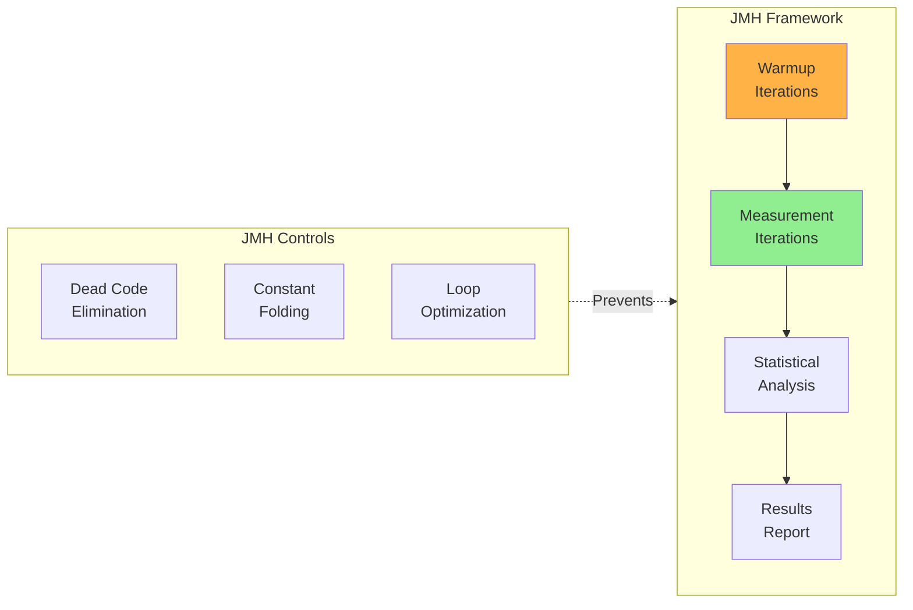
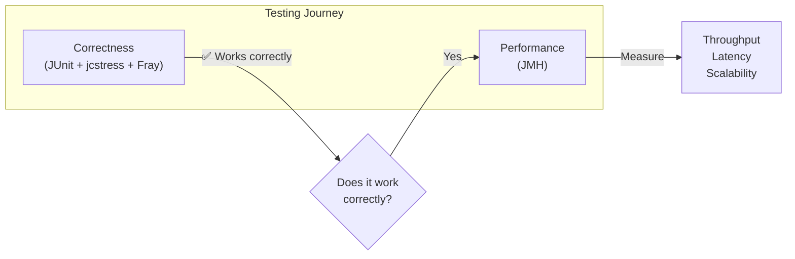
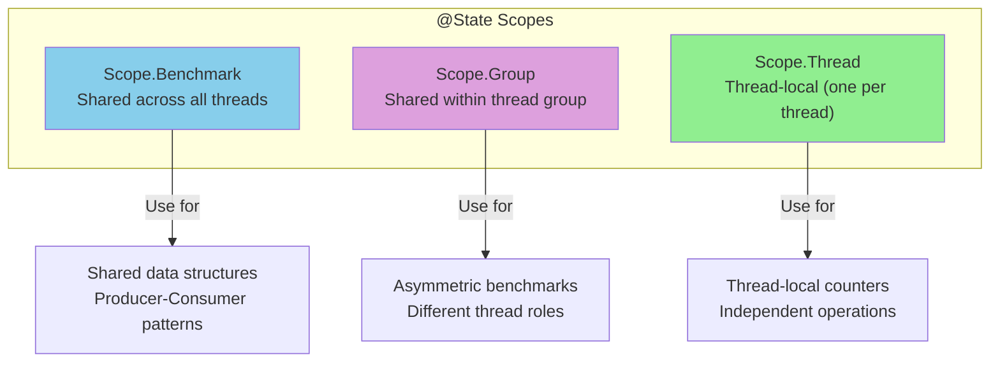
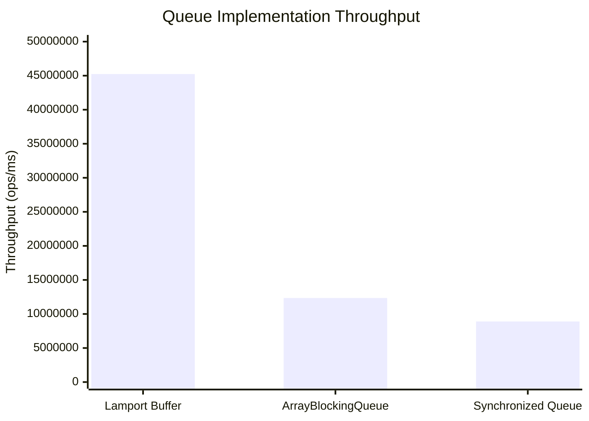
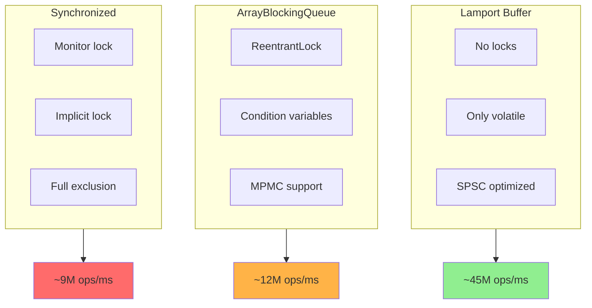
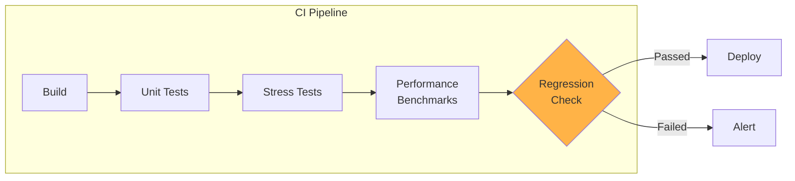
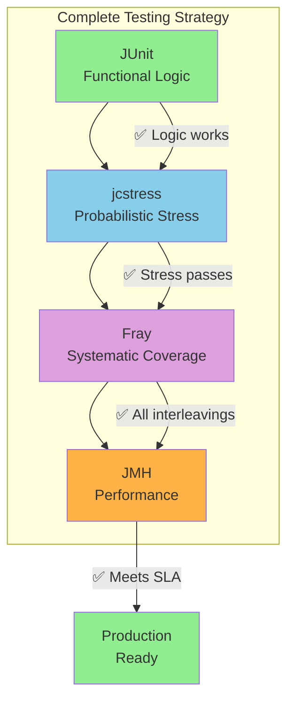

# Part 4: JMH Benchmarks
## Duration: ~8 minutes

---

## What is JMH?

**Java Microbenchmark Harness** - the de facto standard for writing accurate Java benchmarks.



**Why JMH?**
- Handles JVM warmup properly
- Prevents common benchmarking pitfalls
- Provides statistical analysis
- Created by OpenJDK performance team

---

## From Correctness to Performance



**Key Point:** Only benchmark code that is **proven correct** first!

---

## JMH Setup

### Maven Dependencies

```xml
<dependencies>
    <dependency>
        <groupId>org.openjdk.jmh</groupId>
        <artifactId>jmh-core</artifactId>
        <version>1.37</version>
    </dependency>
    <dependency>
        <groupId>org.openjdk.jmh</groupId>
        <artifactId>jmh-generator-annprocess</artifactId>
        <version>1.37</version>
        <scope>provided</scope>
    </dependency>
</dependencies>
```

---

## Basic JMH Annotations

| Annotation | Purpose |
|------------|---------|
| `@Benchmark` | Marks benchmark method |
| `@State` | Shared or thread-local state |
| `@Setup` | Initialize before benchmark |
| `@TearDown` | Cleanup after benchmark |
| `@Warmup` | Warmup configuration |
| `@Measurement` | Measurement configuration |
| `@Fork` | JVM fork configuration |
| `@Threads` | Number of concurrent threads |

---

## State Scopes



---

## Benchmark 1: Throughput Measurement

```java
@BenchmarkMode(Mode.Throughput)
@OutputTimeUnit(TimeUnit.MILLISECONDS)
@State(Scope.Benchmark)
@Warmup(iterations = 5, time = 1, timeUnit = TimeUnit.SECONDS)
@Measurement(iterations = 5, time = 1, timeUnit = TimeUnit.SECONDS)
@Fork(2)
public class LamportBufferThroughputBenchmark {
    
    private LamportBuffer<Long> buffer;
    
    @Setup
    public void setup() {
        buffer = new LamportBuffer<>(1024);
    }
    
    @Benchmark
    @Group("producerConsumer")
    @GroupThreads(1)
    public void producer() {
        while (!buffer.offer(System.nanoTime())) {
            // Spin until successful
        }
    }
    
    @Benchmark
    @Group("producerConsumer")
    @GroupThreads(1)
    public Long consumer() {
        Long value;
        while ((value = buffer.poll()) == null) {
            // Spin until available
        }
        return value; // Return to prevent dead code elimination
    }
}
```

---

## Benchmark 2: Latency Measurement

```java
@BenchmarkMode(Mode.AverageTime)
@OutputTimeUnit(TimeUnit.NANOSECONDS)
@State(Scope.Thread)
@Warmup(iterations = 5, time = 1, timeUnit = TimeUnit.SECONDS)
@Measurement(iterations = 5, time = 1, timeUnit = TimeUnit.SECONDS)
@Fork(2)
public class LamportBufferLatencyBenchmark {
    
    private LamportBuffer<Long> buffer;
    
    @Setup
    public void setup() {
        buffer = new LamportBuffer<>(1024);
        // Pre-fill with some data
        for (int i = 0; i < 512; i++) {
            buffer.offer((long) i);
        }
    }
    
    @Benchmark
    public Long offerAndPoll() {
        buffer.offer(42L);
        return buffer.poll();
    }
}
```

---

## Benchmark 3: Comparison with Synchronized Queue

```java
@BenchmarkMode(Mode.Throughput)
@OutputTimeUnit(TimeUnit.MILLISECONDS)
@State(Scope.Benchmark)
@Warmup(iterations = 5, time = 1, timeUnit = TimeUnit.SECONDS)
@Measurement(iterations = 5, time = 1, timeUnit = TimeUnit.SECONDS)
@Fork(2)
public class QueueComparisonBenchmark {
    
    private LamportBuffer<Long> lamportBuffer;
    private ArrayBlockingQueue<Long> blockingQueue;
    private SynchronizedQueue<Long> syncQueue;
    
    @Setup
    public void setup() {
        lamportBuffer = new LamportBuffer<>(1024);
        blockingQueue = new ArrayBlockingQueue<>(1024);
        syncQueue = new SynchronizedQueue<>(1024);
    }
    
    @Benchmark
    @Group("lamport")
    @GroupThreads(1)
    public void lamportProducer() {
        while (!lamportBuffer.offer(1L)) { /* spin */ }
    }
    
    @Benchmark
    @Group("lamport")
    @GroupThreads(1)
    public Long lamportConsumer() {
        Long v; while ((v = lamportBuffer.poll()) == null) { /* spin */ }
        return v;
    }
    
    @Benchmark
    @Group("blocking")
    @GroupThreads(1)
    public void blockingProducer() throws InterruptedException {
        blockingQueue.put(1L);
    }
    
    @Benchmark
    @Group("blocking")
    @GroupThreads(1)
    public Long blockingConsumer() throws InterruptedException {
        return blockingQueue.take();
    }
    
    @Benchmark
    @Group("synchronized")
    @GroupThreads(1)
    public void syncProducer() {
        while (!syncQueue.offer(1L)) { /* spin */ }
    }
    
    @Benchmark
    @Group("synchronized")
    @GroupThreads(1)
    public Long syncConsumer() {
        Long v; while ((v = syncQueue.poll()) == null) { /* spin */ }
        return v;
    }
}
```

---

## The Synchronized Baseline

```java
public class SynchronizedQueue<E> {
    private final Object[] buffer;
    private int head = 0;
    private int tail = 0;
    private final int capacity;
    
    public SynchronizedQueue(int capacity) {
        this.capacity = capacity;
        this.buffer = new Object[capacity];
    }
    
    public synchronized boolean offer(E element) {
        int nextTail = (tail + 1) % capacity;
        if (nextTail == head) {
            return false;
        }
        buffer[tail] = element;
        tail = nextTail;
        return true;
    }
    
    @SuppressWarnings("unchecked")
    public synchronized E poll() {
        if (head == tail) {
            return null;
        }
        E element = (E) buffer[head];
        buffer[head] = null;
        head = (head + 1) % capacity;
        return element;
    }
}
```

---

## Running JMH Benchmarks

```bash
# Build the benchmark JAR
mvn clean package

# Run all benchmarks
java -jar target/benchmarks.jar

# Run specific benchmark
java -jar target/benchmarks.jar "LamportBuffer.*"

# With profiler
java -jar target/benchmarks.jar -prof gc
java -jar target/benchmarks.jar -prof perfasm

# Output to JSON for analysis
java -jar target/benchmarks.jar -rf json -rff results.json
```

---

## Sample Results

```
Benchmark                                Mode  Cnt        Score        Error   Units
QueueComparisonBenchmark.lamport        thrpt   10   45,234,567 ±  1,234,567  ops/ms
QueueComparisonBenchmark.blocking       thrpt   10   12,345,678 ±    567,890  ops/ms
QueueComparisonBenchmark.synchronized   thrpt   10    8,901,234 ±    234,567  ops/ms
```

---

## Results Visualization



---

## Understanding the Results



**Why is Lamport faster?**
- No lock acquisition/release overhead
- No cache line bouncing from lock state
- Minimal memory barriers (only volatile)

---

## Common Benchmarking Pitfalls

### 1. Dead Code Elimination

```java
// BAD - JIT may eliminate this
@Benchmark
public void badBenchmark() {
    buffer.poll();  // Result ignored - may be optimized away
}

// GOOD - Return the value or use Blackhole
@Benchmark
public Long goodBenchmark() {
    return buffer.poll();
}

@Benchmark
public void goodWithBlackhole(Blackhole bh) {
    bh.consume(buffer.poll());
}
```

### 2. Constant Folding

```java
// BAD - Compiler may precompute
@Benchmark
public int badMath() {
    return 2 + 2;  // Replaced with 4 at compile time
}
```

---

## Pitfalls (continued)

### 3. Loop Optimization

```java
// BAD - Loop may be optimized
@Benchmark
public void badLoop() {
    for (int i = 0; i < 1000; i++) {
        buffer.offer((long) i);
    }
}

// BETTER - Use JMH's iteration control
@Benchmark
@OperationsPerInvocation(1000)
public void betterLoop() {
    for (int i = 0; i < 1000; i++) {
        buffer.offer((long) i);
    }
}
```

### 4. Not Enough Warmup

```java
// Ensure sufficient warmup for JIT compilation
@Warmup(iterations = 5, time = 2, timeUnit = TimeUnit.SECONDS)
@Measurement(iterations = 5, time = 2, timeUnit = TimeUnit.SECONDS)
```

---

## JMH Profilers

| Profiler | Purpose |
|----------|---------|
| `gc` | GC metrics (allocations, pauses) |
| `perfasm` | Disassembly of hot methods |
| `perfnorm` | Hardware counters (cache misses, etc.) |
| `stack` | Stack profiler |
| `async` | Async-profiler integration |

```bash
# Example: GC profiler
java -jar target/benchmarks.jar -prof gc

# Output:
# Benchmark                         Mode  Cnt   Score   Units
# LamportBuffer.throughput         thrpt   10   45.23  ops/ms
#   ·gc.alloc.rate                 thrpt   10   12.34  MB/sec
#   ·gc.alloc.rate.norm            thrpt   10    0.00   B/op
#   ·gc.count                      thrpt   10      0   counts
```

---

## Benchmark Configuration Best Practices

```java
@BenchmarkMode({Mode.Throughput, Mode.AverageTime})
@OutputTimeUnit(TimeUnit.MICROSECONDS)
@Warmup(iterations = 5, time = 1, timeUnit = TimeUnit.SECONDS)
@Measurement(iterations = 10, time = 2, timeUnit = TimeUnit.SECONDS)
@Fork(value = 3, jvmArgs = {
    "-Xms2G", "-Xmx2G",           // Fixed heap size
    "-XX:+UseG1GC",                // Specific GC
    "-XX:+AlwaysPreTouch"          // Pre-touch memory
})
@Threads(Threads.MAX)  // Or specific count
@State(Scope.Benchmark)
public class ProductionBenchmark {
    // ...
}
```

---

## CI Integration



```yaml
# GitHub Actions example
- name: Run JMH Benchmarks
  run: java -jar target/benchmarks.jar -rf json -rff results.json

- name: Compare with baseline
  run: python compare_benchmarks.py results.json baseline.json
  
- name: Fail if regression > 10%
  run: |
    if [ $(cat regression.txt) -gt 10 ]; then
      exit 1
    fi
```

---

## Key Takeaways - Part 4

1. ✅ **JMH is the standard** for Java microbenchmarking
2. ✅ **Handles JVM warmup** and compilation properly
3. ✅ **Prevents common pitfalls** like dead code elimination
4. ✅ **Statistical analysis** with confidence intervals
5. 📊 **Profile-guided optimization** with built-in profilers
6. 📌 **Only benchmark correct code** - verify with jcstress/Fray first!

---

## The Complete Picture



