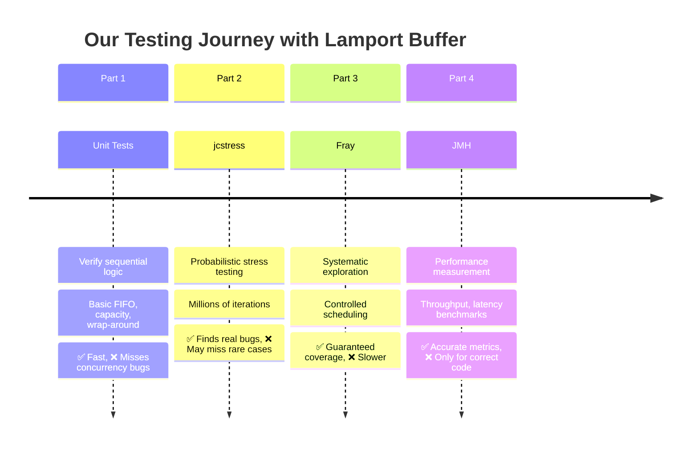
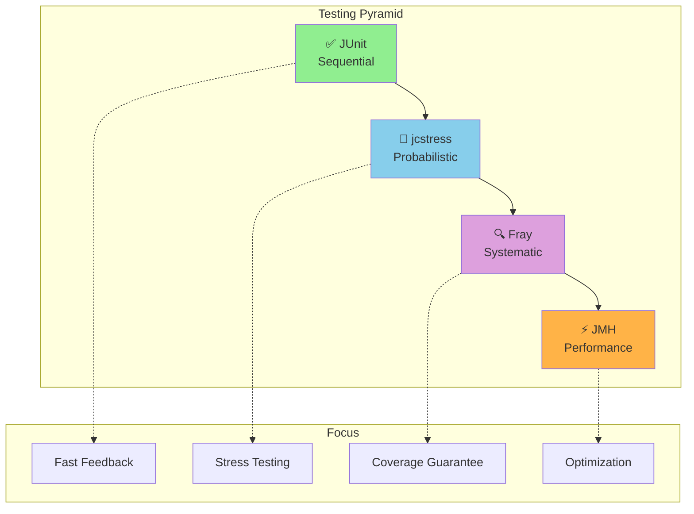
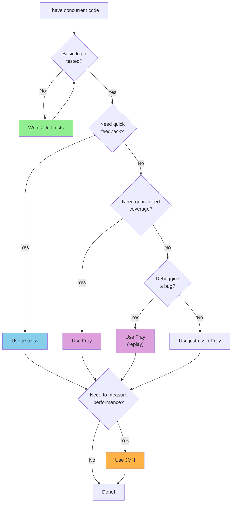
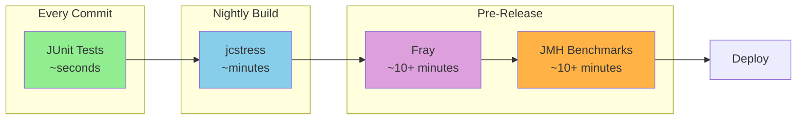
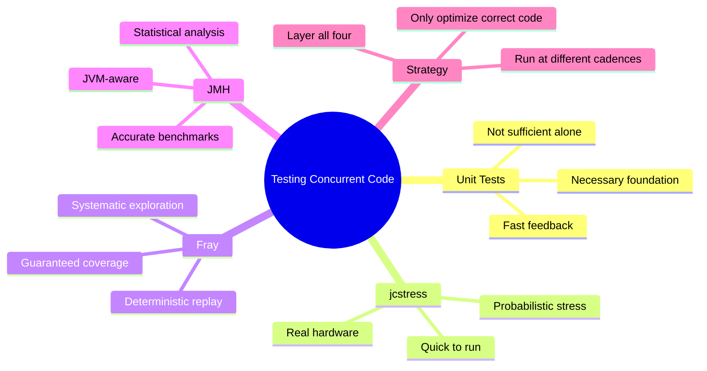

# Summary: Testing Pyramid for Concurrency
## Duration: ~2 minutes

---

## The Journey Recap



---

## The Testing Pyramid for Concurrent Code



---

## Tool Selection Guide

| Question | Tool |
|----------|------|
| Does the logic work at all? | **JUnit** |
| Does it work under thread contention? | **jcstress** |
| Does it work for ALL possible schedules? | **Fray** |
| How fast is it? | **JMH** |
| Can I reproduce a concurrency bug? | **Fray** |
| What happens on real hardware? | **jcstress** |

---

## Decision Flowchart



---

## CI/CD Integration Strategy



---

## Resource Links

### Tools

| Tool | Link | Documentation |
|------|------|---------------|
| **jcstress** | [github.com/openjdk/jcstress](https://github.com/openjdk/jcstress) | Samples in repo |
| **Fray** | [github.com/cmu-pasta/fray](https://github.com/cmu-pasta/fray) | README + Wiki |
| **JMH** | [github.com/openjdk/jmh](https://github.com/openjdk/jmh) | [JMH Samples](http://hg.openjdk.java.net/code-tools/jmh/file/tip/jmh-samples/src/main/java/org/openjdk/jmh/samples/) |

### Further Reading

- [Java Memory Model (JLS Chapter 17)](https://docs.oracle.com/javase/specs/jls/se17/html/jls-17.html)
- [Aleksey Shipilёv's Blog](https://shipilev.net/) - JMH author, performance expert
- [Lamport's Original Paper](https://lamport.azurewebsites.net/pubs/pubs.html)

---

## Key Lessons



---

## Final Thoughts

> **"Testing concurrent code is hard. Not testing concurrent code is catastrophic."**

### The Three Rules

1. **Never trust single-threaded tests** for concurrent code
2. **Combine probabilistic AND systematic** testing
3. **Only benchmark code that is proven correct**

---

## Q&A


---

## Contact & Resources

- **Presentation Materials:** [Available in this repository]
- **Code Examples:** [benchmark-as-a-service/presentation/code/]
- **Follow-up Questions:** [Your contact info here]

### Thank You!

```
🎉 Happy Testing! 🎉
```

